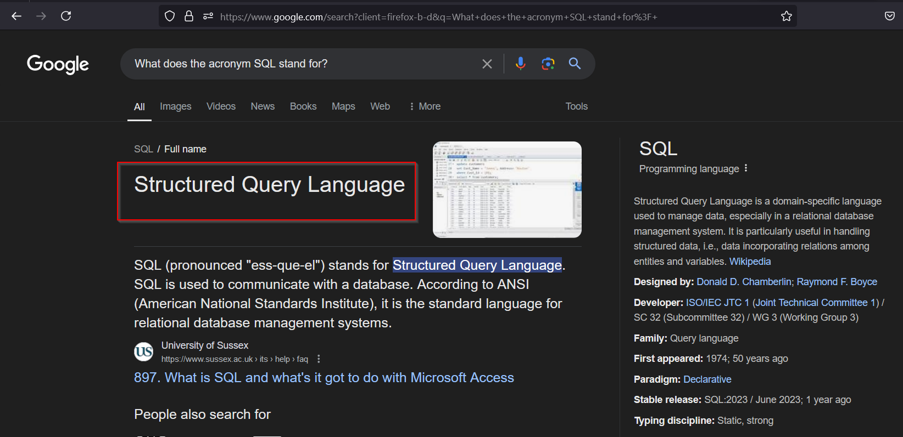

# Appointment

## Task 1

What does the acronym SQL stand for? 

Structured Query Language

## Task 2

What is one of the most common type of SQL vulnerabilities? 

**SQL injection**

## Task 3

What is the 2021 OWASP Top 10 classification for this vulnerability? 

**A03:2021-Injection**

## Task 4

What does Nmap report as the service and version that are running on port 80 of the target? 

Apache httpd 2.4.38 

## **Task 5**

What is the standard port used for the HTTPS protocol? 

443

## Task 6

 What is a folder called in web-application terminology? 

Directories

## Task 7

What is the HTTP response code is given for 'Not Found' errors? 

404

## Task 8

Gobuster is one tool used to brute force directories on a webserver. What switch do we use with Gobuster to specify we're looking to discover directories, and not subdomains? 

dir

## Task 9

 What single character can be used to comment out the rest of a line in MySQL? 

#

## Task 10

If user input is not handled carefully, it could be interpreted as a comment. Use a comment to login as admin without knowing the password. What is the first word on the webpage returned? 

Congratulations

After I visited the site, I went ahead and used the payload admin’ # on the username field and then put some gibberish data on the password field  and was able to log in. I got my payload from [PayloadAllThings](https://github.com/swisskyrepo/PayloadsAllTheThings/blob/master/SQL%20Injection/MySQL%20Injection.md#mysql-error-based).

And just like that, we were able to pawn the machine .