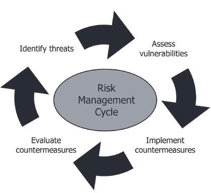
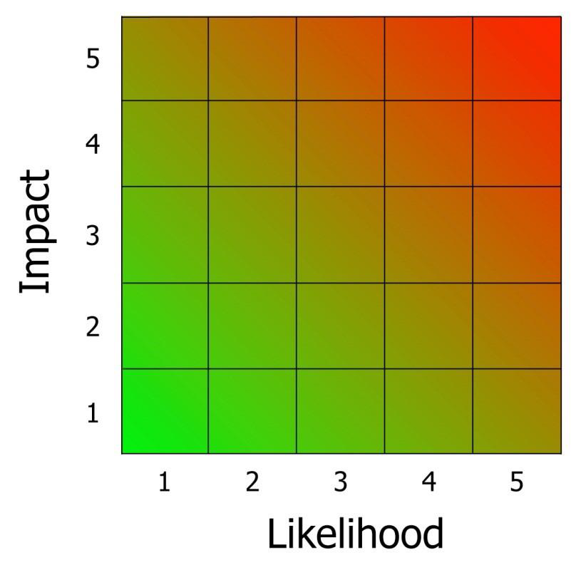
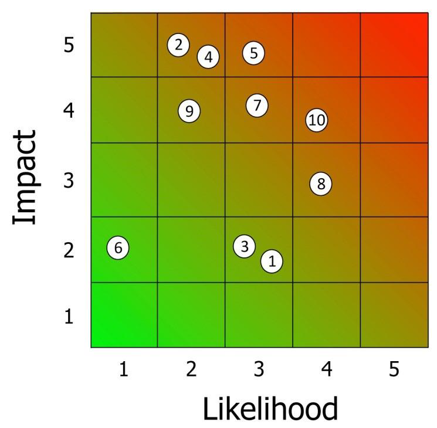
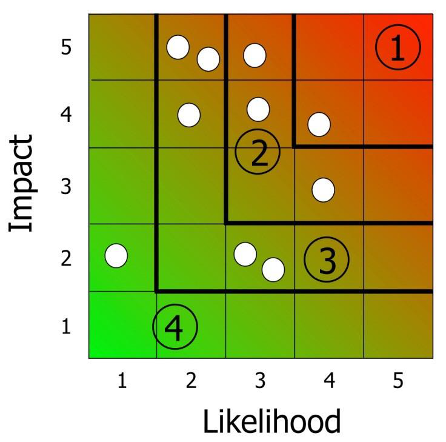
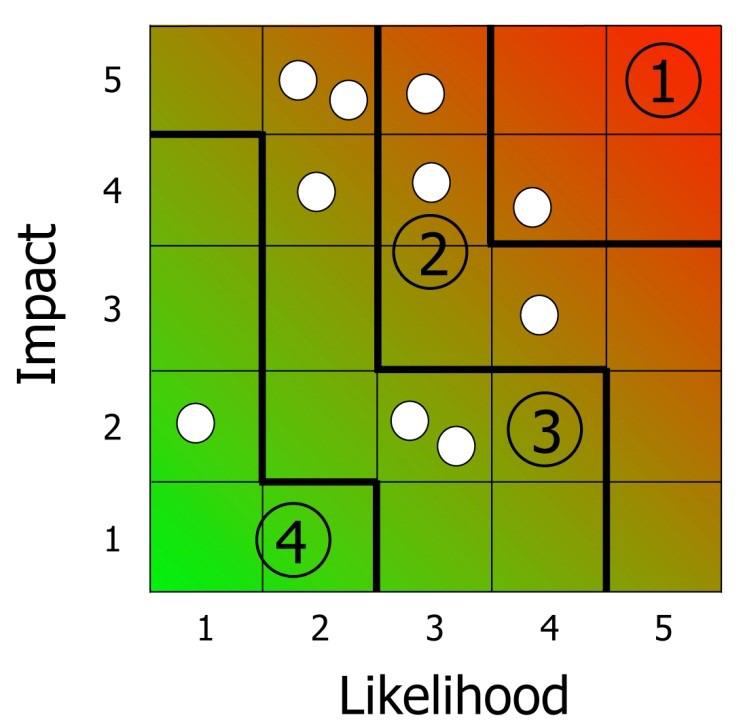
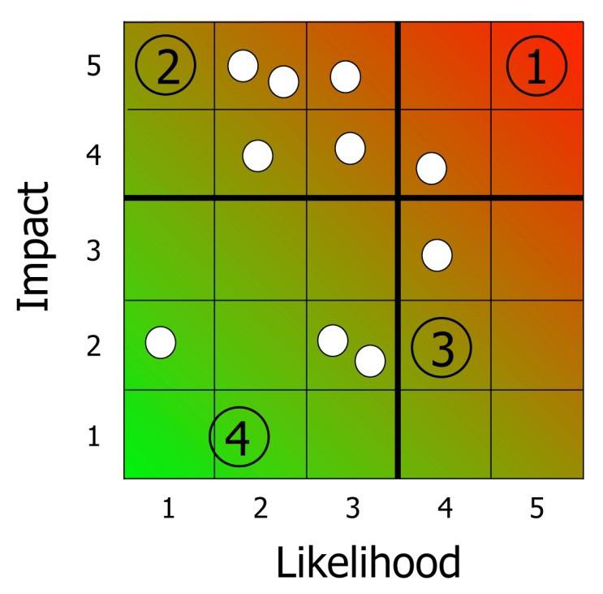
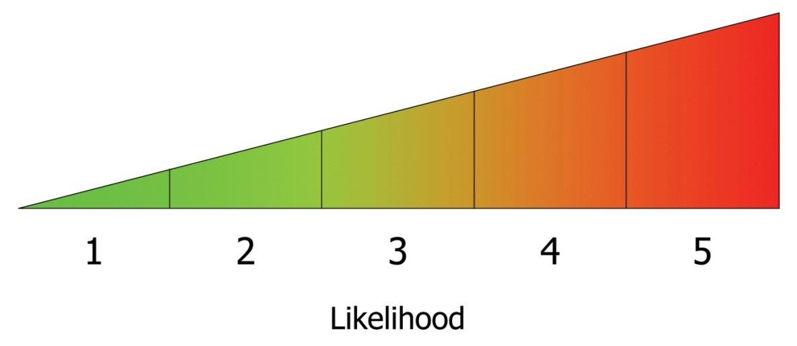
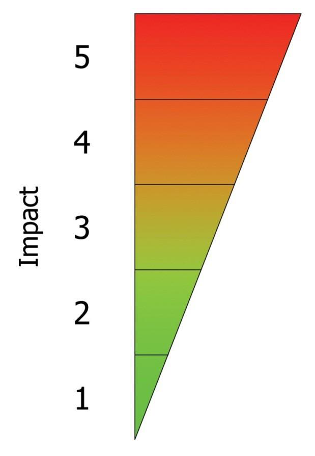
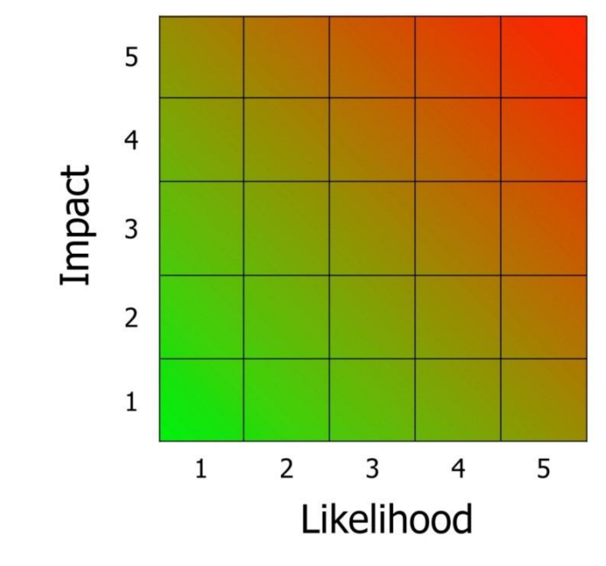

---
title: "Risk Analysis and Risk Assessment"
date: 2025-03-05T12:00:00+03:00
description: "Understanding the key aspects of risk analysis and risk assessment in cybersecurity."
draft: false
tags: ["Risk Analysis", "Risk Assessment", "Cybersecurity"]
categories: ["Cybersecurity", "Risk Assessment", "Risk Analysis"]
---

# Botany risk analysis by kelvin kiplagat

**Contents**

The aim of this guidance

Botany lab security

Botany lab security risk assessment

Risk management in Botany lab security

Risk assessment: an overview

The Botany lab risk assessment methodology

The group-level risk assessment

The role-based (individual) risk assessment

Next steps analysed by kelvin kiplagat mutai

Annex A: Blank personnel security risk assessment tables and example completed risk

assessment tables

Annex B: Diagrams for use in personnel security risk assessments

Annex C: Who should be involved and where to find threat advice

**The aim of this guidance**

Botany lab security risk assessment focuses on employees, their access to their organization’s assets,

the risks they could pose and the adequacy of existing countermeasures. This risk assessment is

crucial in helping security and human resources (HR) managers, and other people involved in

strategic risk decisions, communicate to senior managers the risks to which the organisation is

exposed. This guidance aims to help risk management practitioners to:

- Identify risk.
- Estimate all assets and estimate the value.
- Conduct threat assessment (physical threats, logical threat, environment threat).
- Vulnerability identification assessment from each vulnerability.
- (T- V) paring of threats and vulnerabilities.
- Estimates the probability of the likelihood of attack.
- Calculating the impact/impact analysis.
- Identifying select appropriate control risk treatments.
- Evaluating the effectiveness of the control measure.
- Recommendation to control the threats.
- Result documentation.

2

**Botany lab security risk assessment**

This guidance explains how to use one type of methodology; it is not the only type of risk assessment but it is unique in that its focuses upon the risks posed by the people with legitimate access to the assets in your organization. It is simple, robust, flexible and transparent. It can be used alone or as an ‘add-on’ to your existing risk assessment programme. Whilst the guidance explains how to examine the risks that people pose to your valued assets, it does not attempt to indicate which of those assets are the most important or which group of employees might pose the greatest threat. This will require your own expertise and knowledge of your organisation. Each sector has its own risks and each sector knows its business the best.

**Risk management in Botany lab security**

The use of appropriate Botany security measures can prevent or deter a wide variety of insider attacks, from staff fraud through to the facilitation. However, some of these measures can also be labour intensive and costly, and may result in delays to practical processes such as lab session, so it is important that they are implemented in a way that reflects the severity of the risk. Risk management provides a systematic basis for proportionate and efficient botany lab security.

Risk management is the foundation of the Botany lab security management process and is a continuous cycle of:

- **Risk assessment**– assessing the risks to the organisation and its assets in terms of the likelihood of a threattaking place, and the impact that such an event might have.
- **Implementation** – identifying and implementing security measures to reduce the likelihood and impact of the threat to an acceptable level (risk can never be 100% eradicated).
- **Evaluation** – assessing the effectiveness of the countermeasures and identifying any necessary corrective action.

3

*The Risk Assessment process covers the **Identify threats** and **Assess vulnerabilities** stages of the Risk Management Cycle.*

The cyclical nature of the risk management process ensures that each time a risk assessment is repeated, the implementation and evaluation stages are also reviewed. Much of the value of the risk management process comes from the systematic exploration of threats, opportunities and countermeasures through engagement with the relevant parties (these will differ between organizations but may include senior head of Botany department, lab technicians, senior

management and other technical specialists where appropriate).

**Risk assessment: an overview**

The methodology described in this guidance defines risk as the product of two factors: the likelihood of an event occurring, and the impact that the event would have and end up by coming up with a (T-V) paring When each of these factors has been evaluated, they are combined and this provides the overall measure of risk. In this methodology the risk scores are relative rather than absolute and graded on a scale of 1-5 (1 is least likely/least impact and 5 is most likely/most impact).

**Likelihood of an insider event happening**

This can be broken down into three factors:

**Intent** – a measure of the insider’s determination to carry out the attack.

**Capability** – the degree to which an insider has the skills, knowledge and resources to be successful in the attempt.

**Opportunity** – a combination of the access that an insider has to an organization’s assets (this access will vary depending on their role) combined with the vulnerability of the environment.

**Impact**

This should be considered in terms of the value of the assets affected and any wider consequences. For example, many incidents have financial, operational and reputational impact.

**The stages of risk assessment**

**The risk assessment process:** it is important to follow the risk assessment process step-by-step and not make assumptions about the final outcomes. The risk assessment process described in this guidance is carried out at the following levels.

- **Organisation-level risk assessment**: the organisation level risk assessment identifies the range of insider threats that an organisation faces and prioritizes these in terms of their likelihood and impact.

4

- **Group-level risk assessment**: this stage requires assessment of which groups of employees have the most access to key assets and therefore the greatest opportunity to carry out the threats identified at the organisation level. It also considers the capability necessary to carry out a threat; for example, would someone have to have technical knowledge or could someone with no specialist knowledge carry out the threat. Once this level is complete, the adequacy of existing countermeasures which may mitigate the risk which certain roles pose will be considered and new ones may be suggested.
- **Role-based (individual) risk assessment**: this is an optional level which will not always be necessary for every organisation. It can be carried out if there are high risk roles which require their own detailed personnel security risk assessment. This process is resource intensive and requires key personnel who know the role well and the access it affords. As with all risk assessments it is important to keep the information secure and ensure that it remains confidential; this is especially important when carrying out role-based level risk assessments.

**Conducting a botany lab risk assessment**

**Who should be involved?**

Risk assessments are most effective when they are an integral part of a risk management process. This helps to ensure that the risk assessment will be translated into action. Best results are achieved when the assessment team comprises:

- Staff Botany member teams with responsibility for risk management.
- Individuals with deep knowledge of particular employee roles (e.g. IT managers for IT roles).
- Optional – a trusted external contact to provide an alternative perspective and challenge received wisdom.

**To get the most out of botany lab Security Risk Assessment:**

**The risk assessment requires discussion and indeed benefits from opinions being shared from** different **parts of an organisation. Enlarged reproductions of the diagrams at** Annex B, **together with marker pens and sticky notes can help to increase participation and capture information effectively. You may also find it useful to nominate a scribe who captures the output from discussions on a spread-sheet which can be referred to during and after the process.**

5

**The Botany lab risk assessment methodology**

**Step 1: Identify the risk.**

Before exploring and identifying the threats to your organisation Botany lab, it is helpful to consider the key function/s of your organisation lab: what must it be able to deliver or protect at most? This will help to identify which organizational assets are necessary to achieve that function.

**The following assets were identified during our field risk analysis:**

Microscope pipette

Scalpel tongs

Test tubes dropper

Dropping bottle syringe

Forceps

V-dumeric flask Staining rock spectrophotometer

Beaker Petri dish

Staining rack Fume hood

Flask beam balance

Centrifuge Bunsen burner

Thermometer clay triangles

Measuring cylinder Glass funnels

Safety glass Hot plate

Evaporating dish Computer Iron ring fridge

Burette

ventilation windows Electricity sockets water drainage

6

Number and note down the insider threats your organisation is at risk from in the table:

| **Insider threat** | **Likelihood (1-5)** | **Assumptions (likelihood)** | **Impact (1-5)** | **Assumptions (impact)** |
| --- | --- | --- | --- | --- |
| 1. Individual sells sensitive staff data including salary details and confidential project information to commercial

competitor |  |  |  |  |
| 2. Individual deactivates fire alarm system in protected server area and starts fire to sabotage organisation’s network |  |  |  |  |

**Step 2: Assess likelihood**

Once the list of threats is complete and the definitions are clear and detailed, the next step is to consider how likely each threat is to occur. This information will be recorded under the **Likelihood** column and the assumptions which you make should also be noted down.

This stage of the assessment is to establish the relative likelihoods of each threat, grading them from 1 (least likely to occur) to 5 (most likely).

It may be helpful to begin by taking a look at the list of insider threats facing your organisation, making a rough assessment of which is most likely to occur, and assigning it a likelihood of 5; then identify the one that is perceived to be the least likely to occur, and assign it a likelihood of 1. This will provide reference points and help with consistency when evaluating the remaining threats on the same scale.

| 1 | 2 | 3 | 4 | 5 |
| --- | --- | --- | --- | --- |

Likelihood scale

As you decide on a likelihood value for each new threat, you may find that you reassess where those you have already placed on the scale need to sit. This reshuffling process will continue until the relative likelihood of all the threats has been agreed.

In deciding the likelihood of each threat, it will be necessary to make some assumptions. This assumption, and all others that influence the decision about likelihood, should be recorded in the ‘Assumptions (likelihood)’ column of the table. This will be useful when considering

countermeasures later, and it increases the transparency of the risk assessment process. It also enables the risk assessment to be reviewed more effectively when it is revisited in time or by others.

| Insider threat | **Likelihood (1-5)** | **Assumptions (likelihood)** | Impact (1-5) | Assumptions (impact) |
| --- | --- | --- | --- | --- |
| 1. Individual sells sensitive staff data including salary details and confidential

project information to

commercial competitor | **3** | **Headhunting is common**
**practice; Database access is not audited; no clear owner of**
**database; there are several**
**older versions of database**
**which still contain valid data** |  |  |
| 2. Individual deactivates fire alarm system in

protected server area and starts fire to sabotage

organisation’s network | **2** | **Fire alarm system in access**
**controlled building in a**
**secured room; technical ability required to override zoned**
**alarm system** |  |  |

Things to consider when assessing likelihood:

- **Potential target**– how realistic is it that your organisation could be a target for a certain type of attack?
- **Precedence** – has your organisation been the subject of such an attack before? Perhaps your site has not been harmed but such attacks have taken place in your sector. This does not mean that it could not happen again, just as the fact of no precedence does not mean that a threat will not happen. Remember that if an attack has occurred before there may now be countermeasures in place which will reduce both the likelihood and impact.
- **Security situation**– what is the security culture like in your organisation? Are there lots of security incidents, and how are they dealt with?
- **Ability** – do your employees have the expertise to carry out the kind of attacks you have detailed as threats?

**A good way to assign a value and keep the risk assessment process moving is to take an average of the scores put forward by participants. A simple way of doing this is to get each**

8

**participant to show the number they think the threat is on the relative scale. An average can then be taken. This process can be used for both likelihood and impact**

**scores.**

**Step 3: Assess impact**

Impact is also assessed using a relative scale ranging from 1 (lowest impact) to 5 (greatest impact). Again, make a rough assessment of the threat with the lowest impact (1) and then assign 5 to the threat with the highest impact. Although the scale is relative, it should be based

- Financial loss
- Reputational damage – effect to internal and external reputation
- How long would it take to resume business as usual?
- Adequacy of contingency plans and existing countermeasures

on factors that are meaningful to your organisation, such as:

- Number/importance of sites affected
- How many potential injuries or fatalities amongst employees or the public

Impact scale

The assumptions you make about these – and other – factors affecting the impact value should be recorded in the **Assumptions (impact)** column. As with likelihood, determining the impact entails going through each threat in turn and assigning a relative value from 1-5. The existing threats will need to be reviewed and reshuffled each time a new threat is considered, until those involved agree on the values assigned. At that point, the relative impact of each threat should be recorded under **Impact (1-5)** in the table.

| Insider threat | **Likelihood (1-5)** | **Assumptions (likelihood)** | **Impact (1-5)** | **Assumptions (impact)** |
| --- | --- | --- | --- | --- |

9

| 1. Individual sells sensitive staff data including salary details and confidential

intellectual property to

commercial competitor | 3 | Headhunting is common

practise; Database access is not audited; no clear owner of

database; there are several

older versions of database

which still contain valid data | **2** | **Reputational damage and potential drop in**
**share price; financial**
**losses due to**
**intellectual property**
**loss (patents); potential costs if (a) employees are headhunted (b)**
**replacements are**
**needed** |
| --- | --- | --- | --- | --- |
| 2. Individual deactivates fire alarm system in

protected server area and starts fire to sabotage

organisation’s network | 2 | Fire alarm system in access

controlled building in a secured room; technical ability required to override zoned alarm

system; sabotage not a high

concern in the sector | **5** | **Possible loss of life if fire not discovered**
**quickly; damage to**
**server; no back-up site & this is work place for >4 teams (80+ people); possible loss of data**
**and records; large**
**financial loss in terms of compensation,**
**repairs and recovery** |

**Step 4: Determine the risk priority**

Now that the likelihood and impact values have been decided they can be used to determine the risk priority of each threat.

In some risk assessment methodologies the likelihood and impact values are simply multiplied together to give a value, for example a likelihood score of 2 and an impact score of 3 would lead to an overall score of 6. The Personnel Security Risk Assessment does not prioritise this way as something with a low likelihood but high impact or high likelihood but low impact would have the same score and therefore be considered with equal ranking in terms of prioritisation. In this methodology the two different scores are plotted on a matrix which provides a quick gauge as to where the focus of your organisation’s resources should go to deal with the highest priority threats.

CPNI is impact driven but it may be that in your organisation you wish to deal with those threats which are most likely even if their impact is lesser, for example low-value metal theft.

10

When the threats have been transferred to the matrix, this is an important opportunity to look again at each threat and its associated assumptions, to ensure that it appears in the right place on the matrix, relative to the other threats. Sometimes it is not until this stage that the correct place for a threat is identified as it does not fit with the others grouped around it. If a threat is clearly in the wrong position then the threats should be shuffled so that they are in a more realistic position.

Remember, if any threats are repositioned then you should record any new assumptions about likelihood or impact or amend existing ones.

**Determine the risk priority**

Once the threats are positioned on the matrix (see matrix 1) the prioritisation can begin. This methodology uses a 4-point priority scale, where 1 equals highest priority and 4 equals lowest priority). The threats in the top right corner of the chart, with the highest likelihood and the greatest impact, will need to be urgently addressed (they are priority 1), while those in the bottom left corner which have the lowest likelihood and least impact, can be addressed as a lower priority (they are priority 4). CPNI advocates an impact-driven approach but care must also be taken with

highlikelihood low impact threats. Some visual examples of how the matrix can be divided up are given below (see matrices 2-4). The numbers on the grid refer to the threats given in the sample completed personnel security risk assessment at Annex A:

11

**Matrix 1**

**Matrices 2-4 showing some ways of dividing up the matrix into different priority areas: Matrix**

**2**

12

**Matrix 3**

**Matrix 4**

**The group-level risk assessment**

Once threats have been identified, analysed and prioritised, the organisational level risk assessment is complete for the time being. Looking in detail at which groups have access to your organisation’s assets will give a clear indication of which groups of employees have the greatest opportunity to carry out the threats which were assessed at the organisation level.

As the group level table is populated, it will produce a record of the groups of individuals with access in your organisation best placed to carry out the threats, and why i.e. proximity, ability, frequency of 13

access or lack of oversight. The risk assessment will not look at motivation and it is important not to add judgements onto groups such as assuming that a threat of theft is more likely in a lower paid group or that the threat of information being passed out of an organisation is more common amongst contractors. If such an approach is taken there is a danger that the risk assessment will be inaccurate as the access of other groups will not be fully explored.

**Example of worked entry for group-level risk assessment:**

| **Insider Threat Number** | **Risk**
**Priority Area** | **Employee**
**groups**
**with high**
**opportunity** | **Reasons** |
| --- | --- | --- | --- |
| 2. (Someone deactivates fire alarm system in

protected server area and starts fire to sabotage

organisation’s network) | 3 | Security

manager x 1
Team leaders x 4
IT server

engineers x 8
Internal fire wardens

x 4 | Has access to and technical expertise of alarm systems and access control systems; also has access to server rooms
Have limited access to alarm system to reset after false alarms but no specialist technical knowledge
24/7 access to server room and potentially have enough technical knowledge to be able to

override alarm system AND cooling system
Action required: access and technical knowledge of fire wardens unknown amongst those

attending the risk assessment |

The purpose of this stage is to identify the subsets of individuals in your organisation on which the risk assessment should concentrate. The group level of the risk assessment provides more insight into the management of personnel security risks within your organisation. You should begin by taking each threat in ***priority*** order (1, 2, 3, etc.) and then consider which groups of personnel have the greatest opportunity to carry them out.

Here you will be considering mainly the levels of access given to an organisation’s assets:

information, materials, systems, buildings and people. Judgements should be based on the following points:

- How frequently individuals have access to the asset/s under threat. • The vulnerability of the environment to an attack by an individual.

When deciding which groups of people have opportunity to carry out threats it is likely that the groupings will to some extent reflect job roles within the organisation. For example, if the threat under consideration concerns the compromise of IT systems, then one group with high opportunity is likely to be the IT Systems Administrators (remember, these may be permanent employees, contractors or a mixture of both) , due to their unsupervised systems access and high level

14

passwords. However, some groupings will not correlate quite so directly to organisational job titles, so it is important to think about all personnel carefully, and not be constrained by job titles.

Depending on the degree of detail that you wish to pursue, you may find that this stage of the assessment becomes a significant research and analysis exercise, involving the collation of

information about the organisation’s employees and the roles that they perform. This will only be necessary if there are major gaps in knowledge or the people with this knowledge are not present at the risk assessment.

**Recording the size of the groups**

It is useful to make a note of the approximate size of the group involved which is why the presence of HR colleagues in the risk assessment process is important. If a large number of people have access to a key asset it may mean that the likelihood score has to be revisited. Sometimes it is not until this stage of the risk assessment takes place that the full extent of individuals’ access is realised.

**Countermeasures**

Although the threats which have been considered throughout the risk assessment process are *personnel security* threats, they may not require personnel security countermeasures to mitigate them. It may be identified that a way of mitigating an identified personnel security threat is to install a security door which is a physical security measure. This final stage of the risk assessment process will cover in more detail the type of security measures which may reduce risk by considering existing and potential countermeasures. This stage of the risk assessment may help an organisation to find that it can redeploy valuable security assets to the areas of greater need, thus saving resources.

The last stage of the risk assessment process is to assess what countermeasures are in place and evaluate whether these are sufficient or a gap is identified where more could be done to strengthen, increase or indeed apply a countermeasure in the first place. These could be personnel, physical or information security countermeasures which could range from simple amendments to existing policy to major infrastructure changes. Some countermeasures may be more straightforward to implement than others, for example, if a protective monitoring measure such as CCTV or IT monitoring is introduced, your organisation will need to inform all staff and ensure that any existing policies and procedures are updated accordingly.

**Risk appetite**

There may, of course, be reasons why certain countermeasures cannot be implemented, such as a need to access an area at all times. In such situations the risk assessment may highlight that a key asset needs to be moved to a more secure location, or it may be the case that the risk is recognised and the organisation is aware of the potential consequences. How palatable this is will depend on the risk appetite within individual organisations. The decisions made during the risk assessment, and the logic behind these, to take no action should also be recorded in the table.

Again the threats are considered in priority order. Begin by listing in the **Existing** column all countermeasures currently in place to help prevent the groups from carrying out the threat

| Insider | Group | **Countermeasures** |  |  |
| --- | --- | --- | --- | --- |

15

| Threat

Number |  | **Existing** | **Adequate? If no, give reason/s** | **New or**
**improvement for existing**
**measure** | **Task**
**assigned to** | **Date of**
**expected**
**completion** |
| --- | --- | --- | --- | --- | --- | --- |
| 2 | Security

manager
Team

leaders | Intruder alarms

on fire alarm

system itself

which alerts third party that it has been accessed
Pre-employment screening

including

financial checks
Random auditing of access control system | Yes
Yes
No; Audit

reports only sent to head office, not

relevant sites so any

identified

issues are

dealt with

too slowly | Change process to ensure report is sent to head

office and

affected site at same time | Kate Foot, head of

audit

operations | By end of 3rd quarter of

this

financial

year |

**Timeline**

The columns marked **task assigned to** and **date of expected completion** underline the importance of having the right people involved in the risk assessment process. Those involved need to take responsibility for the identified tasks so that the risk assessment has impact.

**The role-based (individual) level risk assessment**

If your organisation has a number of high risk roles it may be helpful to risk assess these at an individual level so that the access these roles have is fully understood. This can also help with decisions such as what level of screening is required for certain roles so that resources can be applied in a more effective way. It is important to note that this level of risk assessment should be used to assess the role and not the job holder.

One of the areas where a role-based risk assessment may prove useful is during a post-incident investigation when it can be used to gain in depth knowledge of how much access the role in question has.

16

**Next steps**

Risk assessment includes the **identify threats** and **assess vulnerabilities** stages of the Risk Management Cycle. The remaining two stages are **implementation**, which involves making improvements to existing and putting in place new countermeasures identified by the risk assessment into operation, and **evaluation**, during which the effectiveness of the countermeasures is reviewed. The lists of assumptions made during the risk assessment will prove particularly useful during this evaluation.

It is essential that those who take part in the risk assessment have clear roles and responsibilities so that any actions identified have a defined owner. It is up to individual organisations as to how frequently they carry out a personnel security risk assessment but if there are lots of actions identified it will be beneficial to revisit the process sooner rather than later. Depending on how much time has passed since the risk assessment, the evaluation stage should also show that the threats identified have moved either further to the left of the risk matrix, indicating a reduced likelihood, or further down the matrix, showing that the impact has been reduced as a result of the countermeasures you have introduced. It is worth bearing in mind, however, that factors outside your control, such as current terrorist threat level, or economic, political or social issues, may also have an influence. The same factors are likely to introduce new threats to be addressed in future risk assessments. However, just as every risk cannot be eradicated, risk assessments cannot cover every threat as there will always be ones which are not foreseen. The risk assessment should be refreshed, for example, during major operational changes, or when significant changes to working practices are taking place. It can also be used as a tool to help effectively manage change while considering the associated security risks.

**Annex A Blank personnel security risk assessment tables and example complete risk assessmenttable**

| Insider Threat | Likelihood (1-5) | Assumptions (Likelihood) | Impact (1-5) | Assumptions (Impact) |
| --- | --- | --- | --- | --- |

| Insider Threat number | Risk Priority Area | Groups with high opportunity | Reasons |
| --- | --- | --- | --- |

17

| Insider Threat Number | Group | Countermeasures |  |  | Task

assigned to | Date of

expected

completion |
| --- | --- | --- | --- | --- | --- | --- |
|  |  | Existing | Adequate? If no, give

reason/s | New or improvement for existing measure |  |  |

18

NOT PROTECTIVELY MARKED **Example of completed risk assessment at organisational level:**

| **Insider Threat** | **Likelihood** **(1-5)** |  |  | **Assumptions (Likelihood)** | **Impact (1-5)** | **Assumptions (Impact)** |
| --- | --- | --- | --- | --- | --- | --- |
| 1. Individual sells sensitive staff data including salary details and confidential intellectual property to commercial competitor | 3 | Headhunting is common practice; Database access is not audited; no clear owner of database; are several older versions of database which still contain valid data. |  | 2 | Reputational damage and potential drop in share price; financial losses due to intellectual property loss (patents); potential costs if (a) employees are headhunted (b) replacements are needed. |  |
| 2. Individual deactivates fire alarm system in protected server area and starts fire to sabotage

organisation’s network | 2 | Fire alarm system in access controlled building in a secured room; technical ability required to override zoned alarm system; sabotage not a high concern in the sector. |  | 5 | Possible loss of life if fire not discovered quickly; damage to server; no back-up site & this is work place for >4 teams (80+ people); possible loss of data and records; large financial loss in terms of compensation, repairs and recovery. |  |
| 3. Individual installs a malware virus on organisation’s main IT system rendering it unusable for 24 hours. | 3 | Technical ability required to inflict damage on main IT system; no common policy on usage of USB sticks across organisation; known issue around viruses being introduced to system due to using ‘found’ USB sticks. |  | 2 | There is a back-up system so essential business can continue;

financial losses due to lost working hours and recovery time would be limited; robust procedures in place due to prior incidents so damage thought to be limited; valuable data has been backed up on separate system. |  |
| 4. Individual brings an IED

(improvised explosive device) into organisation’s headquarters and sets it to detonate overnight in the central research and development laboratory. | 2 | No search regime in most of HQ building; search regime in protected areas is random but thorough; detailed knowledge of work carried out in central laboratory is limited to those who work in it. |  | 5 | Possible loss of life to those personnel who work out of hours in this area, thought to be c. 6 people. ACTION: get accurate figure of night shift for HQ. Financial losses would be considerable and include: compensation, irretrievable loss of R & D project work,

reconstruction costs. Site may be out of bounds whilst police

investigation takes place, could affect more of HQ than just the laboratory. Is contingency site but is 1/3 of size of main laboratory. |  |

19

NOT PROTECTIVELY MARKED

NOT PROTECTIVELY MARKED

| 5. Individual passes sensitive

customer data from a protected database to an organised crime group. | 3 | There are a number of protected databases which contain information of interest to criminal groups; some databases are obsolete but are on a legacy system so passwords are not changed; is precedence for such activity within the sector. | 5 | Previous cases have all had a financial impact and two have led to physical injury and intimidation therefore loss of life cannot be ruled out. Potential financial losses still assessed to be significant despite raised awareness of this activity in organisation and sector. |
| --- | --- | --- | --- | --- |
| 6. Individual passes end of year results to the media ahead of schedule. | 1 | Internal release of results is known widely in most of the organisation; current climate and recent change of

board members means that organisation has been in the news more than in previous years, reports largely negative in tone. | 2 | Recent negative press saw small drop in share price though has recovered; main impact here thought to be to organisation’s reputation; there could be a small financial impact initially but not thought to be an on-going issue. |
| 7. Individual alters the automatic electronic messaging system which sends regular updates to clients so that a link to an offensive website is attached rather than the usual

news bulletin. | 3 | Everyone has internet access but network has content filters; content filters can be overridden with little technical expertise required; full client list not widely known. | 4 | Reputational damage - clients may not trust future communications from organisation; internationally embarrassing and could result in clients moving contracts to competitor. May have financial impact such as taking out apology adverts in trade press. |
| 8. Individual defrauds the

organisation by claiming for

nonwork related purchases as

expenses on their work credit card. | 4 | Work credit cards generally have low limits; work expenses only audited once a year; receipts only required for purchases over GBP30. | 3 | Financial loss could be significant if on high-limit card, if purchases are less than 30GBP could go undetected for a long time and therefore still add up to significant amount; very few personnel do NOT have work credit cards so this could be wide-scale issue . |
| 9. Individual corrupts HR software so that all bank details held on file are altered by one digit. | 2 | Each site has several ‘super users’ with enhanced access rights to HR software; people can amend their own details on the system but some have to be submitted for checking. | 4 | Entire organisation (>450 people) could be affected as HR software is used to pay everyone regardless of contract; reputational damage internally and externally; expensive to put right (a) to ‘sub’ people and (b) to rectify corruption on the system. |
| 10. Individual passes sensitive

details of, and facilitates access to, a protected research area for a

member of a single issue group so that they can protest (nonviolently) during a VIP visit. | 4 | VIP visits are at least once a quarter and although plans are dealt with by one team they tend to be well

publicised internally ahead of visits; patchy coverage provided by CCTV on 2 out of 5 designated protected areas; organisation and sector increasingly the focus of single issue groups. | 4 | Reputational damage would be biggest impact, VIP visits attract interest in UK and overseas and therefore damage could be

widespread and long-lasting; significant financial damage as

investigation and security review would be needed. Share price could be affected. |

20 NOT PROTECTIVELY MARKED

NOT PROTECTIVELY MARKED

**Sample from example group level risk assessment, showing how to break down the groups assessed to have high opportunity to out the threats**

**explored at the group level. See pages 11-13 for how the Risk Priority scale was decided. Examples from risk priority areas 1 and 3 are used below:**

| **Insider**
**Threat**
**number** | **Risk**
**Priority Area** | **Groups with high opportunity** | **Reasons** |
| --- | --- | --- | --- |
| 10 | 1 | Management board x 6
PAs to management board x 4
Security manager x 1
Security officers x 40
Press officers x 2
Protected area team leader x 5 | Detailed knowledge of all VIP visits well in advance and access to all parts of site.
Detailed knowledge of all VIP visits well in advance & responsibility for planning logistics for all VIP visits.
Detailed knowledge of all VIP visits well in advance and access to all parts of site. Also have detailed
knowledge of CCTV and other protective monitoring measures in place, and current faults.
Detailed knowledge of VIP visits three weeks in advance and access to all parts of site. Have detailed
knowledge of CCTV and current faults and less detailed knowledge of other protective monitoring
measures.
Detailed knowledge of VIP visits as they are main contacts. No technical knowledge and no access to
anywhere outside of main headquarters unless escorted.
They are informed of a visit to their area at least three weeks in advance; have access and are aware
of some security measures. Two leaders have briefed on CCTV fault. |

21

NOT PROTECTIVELY MARKED

NOT PROTECTIVELY MARKED

| 2 | 3 | Security manager x 1
Team leaders x 4
IT server engineers x 8
Internal fire wardens x 4 | Has access to and technical expertise of alarm systems and access control systems; also has access to server rooms.
Have limited access to alarm system to reset after false alarms but no specialist technical knowledge.
24/7 access to server room and potentially have enough technical knowledge to be able to override alarm system AND cooling system.
**Action required:** level of access and technical knowledge of fire wardens unknown amongst those attending the risk assessment. |
| --- | --- | --- | --- |

**Sample from example of how to assess the adequacy of countermeasures in place or identify the need for improvements or completely new measures.**

| **Insider**
**Threat**
**Number** | **Group** | **Countermeasures** |  |  | **Task assigned to** | **Date of expected completion** |
| --- | --- | --- | --- | --- | --- | --- |
|  |  | **Existing** | **Adequate?**
**If no, give reason/s** | **New or improvement for existing measure** |  |  |
| 10 | Management

board, security manager,

security officers, Press officers,

Protected area team leaders
Management

board, security manager,

security officers, Protected area team leaders | Preemployment screening
Access control passes | Yes
No. System is not

audited; no policy to deal with forgotten or lost passes; known culture of sharing

passes in protected areas. | Pass policy for whole

organisation needs refreshed to state what the disciplinary actions are for sharing passes and what steps should be

taken if a pass is forgotten or lost. | Joint action for HR, Security and IT managers (John Smith, Peter Brown, Sue Roberts) with advice from legal and audit departments. Immediate actions: check whether pass deactivation is | An on-going task but first

meeting of relevant parties to be confirmed by close of play Friday. |

22 NOT PROTECTIVELY MARKED

NOT PROTECTIVELY MARKED

|  |  |  |  |  | carried out as part of exit procedures |  |
| --- | --- | --- | --- | --- | --- | --- |

| 2 | Security

manager and Team leaders | Intruder alarms on fire alarm system which alerts third

party that it has been accessed
Preemployment screening | Yes
Yes |  |  |  |
| --- | --- | --- | --- | --- | --- | --- |

23 NOT PROTECTIVELY MARKED

NOT PROTECTIVELY MARKED

|  |  | including

financial checks
Random

auditing of

access control system | No; Audit reports

only sent to head

office, not relevant

sites so any identified issues are dealt with too slowly | Change process to ensure

report is sent to head office and affected site at same time | Kate Foot, head of audit operations | By end of third quarter of this financial year |
| --- | --- | --- | --- | --- | --- | --- |

24 NOT PROTECTIVELY MARKED

NOT PROTECTIVELY MARKED

**ANNEX B Diagrams for use in personnel security risk**

**assessments**

NOT PROTECTIVELY MARKED

NOT PROTECTIVELY MARKED

**ANNEX C Who should be involved and where to find threat advice**

The personnel security risk assessment considers the risks which organisations face from the individuals (be they permanent employees, individuals on attachment or secondment, contractors, consultants, agency staff, temporary staff and so on). Participants should include security and human resources managers, contingency planners and operational/asset managers, and depending on the organisation and assets being assessed, there may need to be participants from specialist teams such as IT, engineering, finance departments. Information may be needed from administrative and operational support colleagues but it is **not** recommended that such roles are involved in the risk assessment process. A personnel security risk assessment will involve open discussion of the vulnerabilities facing your organisation and sector. It is advised that this information is kept securely and confidentially and is only shared in full with those in your organisation who are personnel security strategic risk decision makers.

Relevant threat advice can be obtained from a range of sources including: CPNI, your local CTSA (Counter Terrorism Security Advisor), NaCTSO (National Counter Terrorism Security Office), your local police force, local business network forums, business partners and co-located organisations and, where appropriate, industry regulators.

For further information on the overall management of people risk in your organisation, including technical guidance, please look at the following interactive PDF: HoMER: Holistic Management of Employee Risk which can be downloaded from the CPNI website.

26 NOT PROTECTIVELY MARKED
