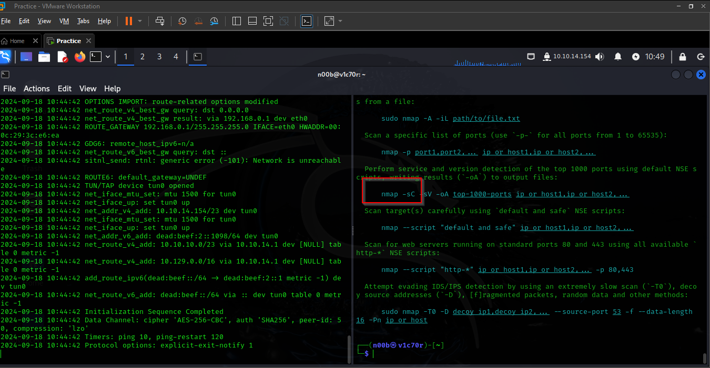

# Crocodile

## Task 1

What Nmap scanning switch employs the use of default scripts during a scan? 

-sC

## Task 2

What service version is found to be running on port 21?

vsftpd 3.0.3 

## Task 3

What FTP code is returned to us for the "Anonymous FTP login allowed" message? 

230

## Task 4

After connecting to the FTP server using the ftp client, what username do we provide when prompted to log in anonymously? 

anonymous

## Task 5

After connecting to the FTP server anonymously, what command can we use to download the files we find on the FTP server? 

Get command but to download all files once, one can use the command mget as seen above.

## Task 6

What is one of the higher-privilege sounding usernames in 'allowed.userlist' that we download from the FTP server?

admin

## Task 7

What version of Apache HTTP Server is running on the target host?

Apache httpd 2.4.41 

## Task 8

What switch can we use with Gobuster to specify we are looking for specific filetypes? 

-x

## Task 9

Which PHP file can we identify with directory brute force that will provide the opportunity to authenticate to the web service?

login.php

After checking, the two files we downloaded, we were adble to get the admin and the password for the as seen as seen below.

we used the above credentials to log in to the platform and we got our flag.

