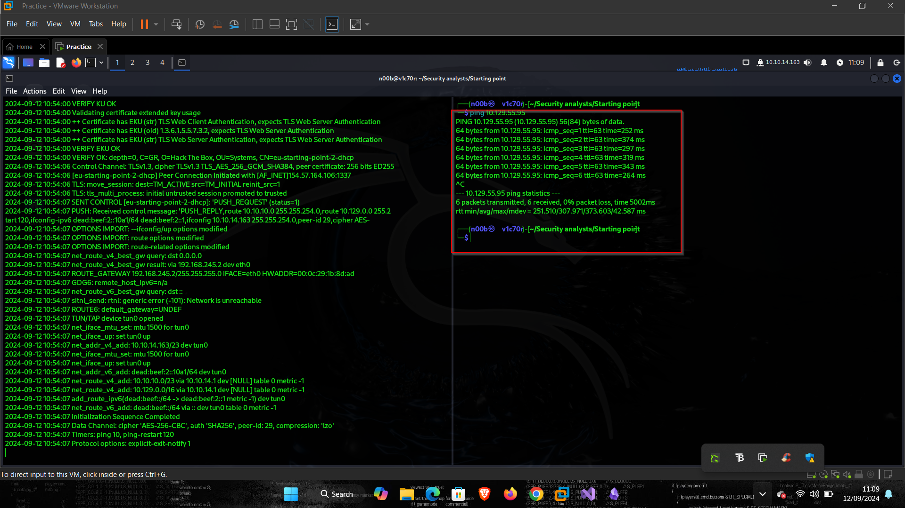

# Fawn

# Introduction

For this machine we shall be exploiting the ftp service to get the root flag of the machine. However, we will first need to do the following.

1. Enumeration of the machine
2. Service discovery
3. FTP anonymous log in

# Enumeration

Before enumerating, we shall start by checking if the IP is reachable from our attacking machine by pinging it as shown below.

After enumeration, we were able to find out that  ftp service is up and running as shown below.

As seen above the host is reachable from our attacking machine. We shall now enumerate the host using nmap using the following syntax as shown below

**Nmap -sCV <IP>**

Furthermore, anonymous log in is allowed hence, we can easily now get our flag and pawn the machine.

# FTP Log in

After that we can now easily login and get our flag from the server easily as shown below.

Below as we can see, we have transferred the flag to our machine

Now we can get the flag and pawn the machine.

With that we have successfully pawned the machine.

We have now successfully pawned the machine

# Conclusion

In this lab we were able to learn that ftp is an insecure service for storing and transmitting of files over the internet, the secure service of it is **SFTP.**