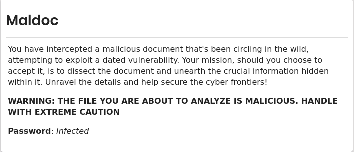

# Maldoc

In this challenge, we are given a malicious document for us to analyze, here is the description of the challenge.



After downloading the zipped folder in our controlled environment, we are required to unzip it using the password given to us.


We are given a file called maldoc.xlsx, however using the file to answer our questions we got wrong answers. I decided  to look if there were any embed files on to the document using binwalk, and it seems to be some files embed on to it as shown below.


yeap, there are some files embed on to our document, lets extract them using the same tool.


## Task 1


we are required to know when the file was last modified,we are required to check the actual file before extracting the embedded files for analysis, maldoc.xlsx.

looking at the metadata of the file, we are bale to get the modification date of the file as shown below, we have two modification dates, hence we shall consider the latest time that was modified which is 


```bash
File Modification Date/Time     : 2023:09:26 15:34:36+03:00
```

answer:  2023:09:26 15:34:36

## Task 2


this one was easy, we just had to use the command **md5sum** on the file to get the hash as shown below.

```bash
──(n00b㉿v1c70r)-[~/…/Maldoc/_maldoc.xlsx.extracted/xl/embeddings]
└─$ md5sum vKlT.JyZ
8244dd7fe06510832017d869ca1e6796  vKlT.JyZ
                                               
```

answer: 8244dd7fe06510832017d869ca1e6796

## Task 3


for this challenge, after getting our hash, I uploaded the hash on [virustotal](https://www.virustotal.com) and the cve was given to us as shown below.


answer: CVE-2017-11882

## Task 4


after uploading the hash on virustotal, I went under behavior and saw a certain url as shown below.


answer : ”[http://81.161.229.226/naun.vbs](http://81.161.229.226/naun.vbs)”