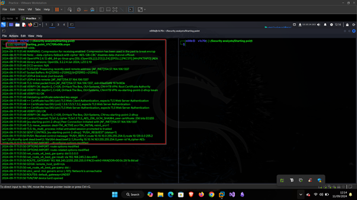

# MEOW

# Introduction

For this machine, we are introduced to the hack the box sphere, where we are required to answer some questions and familiarize ourselves with the basic tools used for enumeration and exploitation of a machine.

The tasks that we shall be doing in this lab are as follows.

1. Lab setup
2. Enumerate the IP given for open ports
3. Exploit vulnerable service identified

# Lab Setup

Before interacting with the machine, we are required to connect to the platform using a vpn file as shown below.

As seen above we have answered the first three questions as shown below.

After connecting to the platform via openvpn, we are then supposed to test the IP provided if is reachable form our attacking machine using the ping command as shown below.

With the above screenshot, our fourth question is answered as shown below.

# Enumeration

After enumerating the IP, we got the following output.

As seen above, port 23 is the only port that is open, the flag used for enumeration with nmap are explained as below.

- sCV - this is a combination of the following two flags,
- sC and -sV, where
- sC instructs nmap to scan the IP provided using default scripts
- sV instructs nmap to scan the IP for services running.

The port open is 23 whose service is telnet, an insecure way of connecting remotely to workstations, as the communication is transmitted in plaintext.

With the screenshot above, we have answered our fifth and sixth questions as seen below.

## Exploiting the telnet service

From the above enumeration, we have clearly identified that telnet service is running, therefore we can now successfully login to the service.

After looking at the hint of the question for logging in to the telnet service, I realised it is a root user require to login to the platform with no password required for logging in as shown below.

We can now be able to get our root flag as seen below.

# Conclusion

From the above lab, we have learnt that to connect to hack the box platform, one requires to connect via a vpn file and to enumerate an IP, we are required to use nmap for enumeration of the IP to identify services running on the IP. Furthermore, we have also learnt that telnet is an insecure service for remotely connecting to devices as it transmits data in plaintext over the network.