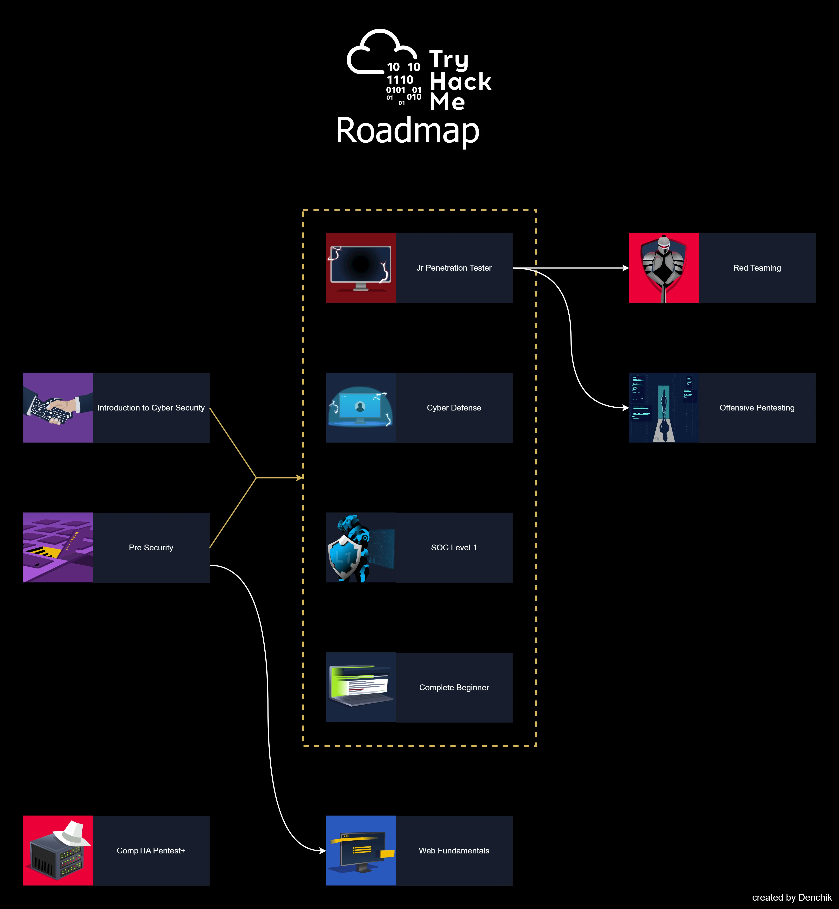
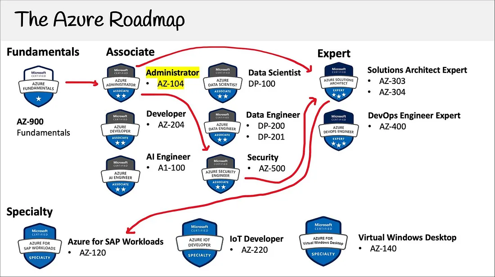

# Getting Started

Have you ever wondered where to begin when starting a career or shifting to a new path? I've been there too. I'll outline the routes that helped me advance in cybersecurity, as well as other tech careers you can explore. I'll also highlight paths for those interested in cloud computing with Microsoft, Google Cloud Platform, and AWS—plus blockchain technology.

# **Cyber Security**

There are many certifications out there for different cyber security roles, however, one needs to also get the basics skills required for getting into cyber security such as networking, understanding different operating systems such as windows and UNIX based operating systems, computing essentials. I will highlight sources on where one can start learning the basics.

## Intro to cybersecurity

### learn Linux fundamental

The sources that one can freely learn on the use of the kali linux operating system hands on is such as

- TryHackMe’s linux fundamental 1 room
    
    [https://tryhackme.com/r/room/linuxfundamentalspart1](https://tryhackme.com/r/room/linuxfundamentalspart1)
    
- Overthewire
    
    [https://overthewire.org/wargames/bandit/](https://overthewire.org/wargames/bandit/)
    
- HackTheBox academy Linux Fundamental module
    
    
    
- HackTheBox Windows Fundamentals Module
    
    
    

### Learn Windows Fundamentals

- HackTheBox Windows Fundamentals Module
    
    
    

### Web Fundamentals

- Overthewire Natas challenge
    
    [https://overthewire.org/wargames/natas/](https://overthewire.org/wargames/natas/)
    
- HackTheBox Web Request Module
    
    
    
- HackTheBox Introduction to web application
    
    
    
- TryHackMe’s web hacking fundamentals module
    
    [https://tryhackme.com/module/web-hacking-1](https://tryhackme.com/module/web-hacking-1)
    

### Networks

- CISCO’s Networking Basics course
    
    [https://www.netacad.com/courses/networking-basics?courseLang=en-US](https://www.netacad.com/courses/networking-basics?courseLang=en-US)
    
- TryHackMe’s Networking Fundamentals
    
    [https://tryhackme.com/module/network-fundamentals](https://tryhackme.com/module/network-fundamentals)
    
- TryHackMe’s Network Exploitation Basics
    
    [https://tryhackme.com/module/intro-to-networking](https://tryhackme.com/module/intro-to-networking)
    

## Intro to Capture The Flag

There are many ways to enter the cybersecurity field, and one effective approach is participating in various Capture The Flag (CTF) competitions. CTFs come in different formats, including jeopardy-style and attack-and-defend. In this section, we'll focus primarily on jeopardy-style CTFs, which feature challenges from diverse categories such as web, forensics, miscellaneous, crypto, reverse engineering, malware analysis, and OSINT (Open Source Intelligence).

Importantly, beyond solving challenges, participants are often required to create write-ups in blog format. This practice not only hones technical skills but also develops the crucial ability to document findings effectively. Such documentation skills are highly valued in the industry, as they enable professionals to produce comprehensive reports for organizations to assess and evaluate their security posture.

Below are some of the platforms that one can practice and participate in CTF

- picoCTF
    
    [https://picoctf.org/](https://picoctf.org/)
    
- CyberTalents
    
    [CyberTalents – A Global Platform For Cybersecurity Talents](https://cybertalents.com/)
    
- TryHackMe
    
    ‣ 
    
- HackTheBox
    
    [HTB CTF Platform | Find & Play CTFs!](https://ctf.hackthebox.com/)
    
- LetsDefend
    
    [https://letsdefend.io/](https://letsdefend.io/)
    
- CTFROOM
    
    [https://www.ctfroom.com/home/](https://www.ctfroom.com/home/)
    
- Cyberranges
    
    [https://www.cyberranges.com/](https://www.cyberranges.com/)
    

Some of the above paltforms also provide certifications that enable one to gain more skills in a certain field of cybersecurity such as red team,blue team and purple teaming. Below are some of the platforms with a roadmap of how to break into there platforms and become successful

- TryHackMe
    
    
    
    
- HackTheBox
    
    [Hack The Box](https://app.hackthebox.com/)
    
- CyberTalents
    
    [CyberTalents – A Global Platform For Cybersecurity Talents](https://cybertalents.com/)
    
- LetsDefend
    
    [https://letsdefend.io/](https://letsdefend.io/)
    
- Cyberranges
    
    [https://www.cyberranges.com/](https://www.cyberranges.com/)
    

# Cloud computing

Many cloud providers offer certifications to familiarize users with their technologies, including Microsoft, AWS, and GCP (Google Cloud Platform). Additionally, there are platforms that provide CTF-like labs where individuals can practice their cloud computing skills. In this section, we'll outline roadmaps to help you break into AWS, GCP, and Microsoft Azure.

- Microsoft azure
    
    As seen below are the certifications that one requires to become azure cloud practitioner.
    
    
    
    
    
- Google Cloud Platform
    
    As seen below  are the certifications that one requires to become google cloud certified practitioner.
    
    
    
- AWS
    
    As seen below is a chart highlighting the certifications one is required to have in order to become an AWS cloud practitioner. However, the are CTF-like labs where one can put their skills to the test, these platforms are such as
    
    1. [Cloudgoat](https://github.com/RhinoSecurityLabs/cloudgoat)
    2.  [aws Flaws](http://flaws.cloud/)
    
    [BzOuxasRm.avif](BzOuxasRm.avif)
    

Beyond obtaining certifications, it's crucial to continuously practice and hone your skills. This practice helps you stay up-to-date with the latest security issues arising from cloud misconfigurations—vulnerabilities that attackers exploit to access organizational resources. Here are some labs where you can actively learn new skills and develop strategies to counter potential attacks:

1. [PwnedLabs](https://pwnedlabs.io/)
2. [Cloudgoat](https://github.com/RhinoSecurityLabs/cloudgoat)
3. [Flaws](http://flaws.cloud/)

# Block Chain

As the world embraces cryptocurrency, Blockchain technologies are growing rapidly. This swift expansion has led more individuals to explore the field, eager to understand the buzz surrounding Blockchain technology. The best platform I continue to learn from is Cyfrin Updraft, a free hands-on course where learners gain knowledge through practical projects. By the end of the course, participants emerge not only with knowledge and skills but also with a completed project—tangible proof of their work.

[Home | Cyfrin Updraft](https://updraft.cyfrin.io/)