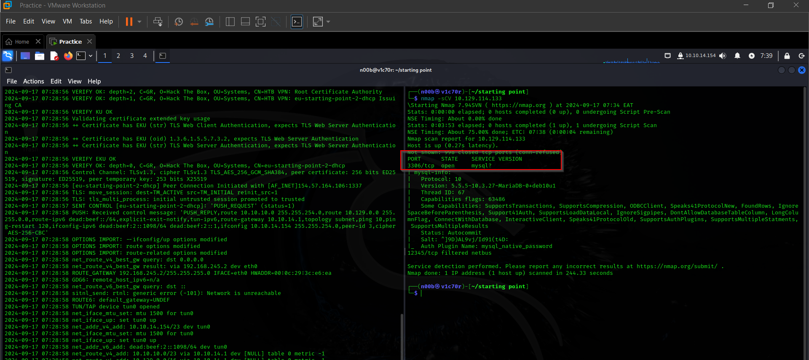

# Sequel

## Task 1

During our scan, which port do we find serving MySQL? 

3306

## Task 2

 What community-developed MySQL version is the target running? 

MariaDB

## Task 3

When using the MySQL command line client, what switch do we need to use in order to specify a login username? 

-u from [Mysql](https://dev.mysql.com/doc/refman/8.4/en/connecting.html)

## Task 4

Which username allows us to log into this MariaDB instance without providing a password? 

root

## Task 5

In SQL, what symbol can we use to specify within the query that we want to display everything inside a table? 

*

## Task 6

In SQL, what symbol do we need to end each query with? 

;

## Task 7

There are three databases in this MySQL instance that are common across all MySQL instances. What is the name of the fourth that's unique to this host? 

htb

To get the root flag, we had to enumerate the htb box as shown below and we found our flag.

We have two tables, users and config.

Selecting the data in users, we found nothing of interest, aside form the users

But for the config table, we found our flag

