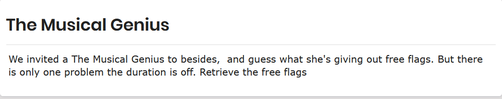

# The Musician

In this challenge, we are given an mp4 file that seems to be corrupted. We shall try to rectify the hex data in order to get the file. Below is  the description of the challenge description.



## Task 1


in order to get the first flag we had to get the correct file headers in order for the file content to be accessible. As seen below, the correct header for the file should look as seen below.


source: https://www.file-recovery.com/mp4-signature-format.htm

and here is our files header.


the header bytes are off, we shall rectify it referring to our source image as shown earlier. However, for one to be able to view the file’s hex data, we can use a tool such as hexeditor.

```bash
hexeditor <file>
```

I tried to edit the header but still got nothing, it seems am editing the wrong file header. Looking at the file specification, after a long resesarch and analysis, I came to find out  that the duration bit of the file was off where by I had to change the lmvh. to lmvhd as shown below.


source: https://www.cimarronsystems.com/wp-content/uploads/2017/04/Elements-of-the-H.264-VideoAAC-Audio-MP4-Movie-v2_0.pdf

to make it easier for one to edit the file, one could use an online [hexeditor](https://hexed.it/) and still get the same file. After editing, we got our file with the first flag as shown below.


```bash
BSidesNBI{W3ll_fr33_fl4g_All_My_L0v3}
```

but the song is weird it is played in reverse, therefore, we are required to play it backwards to get our second flag.

## Task 2


I used this [tool](https://mp3cut.net/) to get the second flag, under the audio tools, I chose reverse audio to get the message clearly

```bash
{hanah_your_music_prodigy}
```