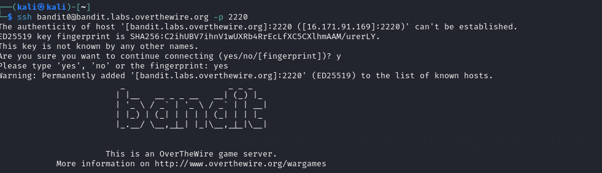

# OverTheWire Bandit Writeup (Level 0 to 15)



If you're starting with cybersecurity, **OverTheWire's Bandit** is a great place to learn. Bandit is a game that helps you get better at using Linux commands, solving problems, and learning important skills that are useful for anyone working in security.

In this guide, I'm sharing my journey from **Level 0 to Level 15**. The goal isn't just to get the flag but to understand how each command works and why it's important. I've also written everything down in a simple, copy-paste format so it's easier for me (and you) to use and understand better.

In my journey, I found **Level 12 to Level 13** of OverTheWire's Bandit wargame quite tough. It took me an extra **3 days** of study and learning to fully understand and work through it. But in the end, it was worth it because I gained a deeper understanding of the concepts!

What You’ll Learn

- Navigating Unix-like file systems
- Using essential commands like `find`, `grep`, `ssh`, `nc`, `openssl`, `xxd`, and `file`
- Interpreting file types and permissions
- Thinking like a hacker to bypass basic security mechanisms
- Using tools like SSH port forwarding and file format analysis

### Requirements

- Linux environment (Kali, Parrot OS, Ubuntu, or WSL on Windows)
- Internet connection
- Terminal access

### Accessing Bandit

Connect using the following command:

```
ssh bandit0@bandit.labs.overthewire.org -p 2220
# Password: bandit0
```

Level 0 → Level 1

**Objective:** Find the password in a readme file.

```
cat readme
```

 `ls` to see the file, then `cat readme` to display the password.

`cat` prints file content to the terminal. A basic yet essential skill.


so  mypassword to the next level is -ZjLjTmM6FvvyRnrb2rfNWOZOTa6ip5If

## Level 1 → Level 2

**Objective:** The password is in a file called `-`.

```
cat ./-
```

`./` tells the system: *look in the current directory*

**Why:** Files starting with `-` can be confused as flags. Prefix with `./` to read it.


my password to the next level is -263JGJPfgU6LtdEvgfWU1XP5yac29mFx

## Level 2 → Level 3

**Objective:** The password is in a file called `spaces in this filename`.

**Use:** `cat "spaces in this filename"` — wrap the file name in quotes due to spaces.

```
cat "spaces in this filename"
```

Filenames with spaces must be wrapped in quotes.


other way of achieving this is through the use of  \


password to the next level is -MNk8KNH3Usiio41PRUEoDFPqfxLPlSmx

## Level 3 → Level 4

**Objective:** The password is in a hidden file in the `inhere` directory.

**Use:** `ls -a inhere/` to see hidden files, then `cat inhere/.hidden` to read it.

```
ls -a inhere/
cat inhere/.hidden 

```

Hidden files start with `.` and are revealed using `-a`.


password to the next level is -2WmrDFRmJIq3IPxneAaMGhap0pFhF3NJ

## Level 4 → Level 5

**Objective:** Find the human-readable file in `inhere/`.

**Use:**  ls, (find . -type f | xargs file) -used to find human readable fileto find a human-readable file, then `cat` it.

**Objective:** Find a file with specific permissions.

```
find . -type f | xargs file
cat ./-file07
```


password for the next level is 4oQYVPkxZOOEOO5pTW81FB8j8lxXGUQw

## Level 5 → Level 6

**Objective:** Find a file with specific permissions.

```
find . -type f -size 1033c ! -executable -readable
cat ./maybehere07/.file2

```

The password for the next level is stored in a file somewhere under the **inhere** directory and has all of the following properties:

- human-readable
- 1033 bytes in size
- not executable


password to the next level is HWasnPhtq9AVKe0dmk45nxy20cvUa6EG

## Level 6 → Level 7

**Objective:** Find a file owned by user bandit7 and group bandit6.

```
find / -type f -user bandit7 -group bandit6 -size 33c 
cat /var/lib/dpkg/info/bandit7.password
```

hint:

The password for the next level is stored **somewhere on the server** and has all of the following properties:

- owned by user bandit7
- owned by group bandit6
- 33 bytes in size

i tried to check and list so that i can see the folder here but there was nothing here….


Nothing to be seen. I decided yo use “find” command properly.i used find and it brought numerous other details has follows 


so i searched for this below characters :/var/lib/dpkg/info/bandit7.password


after tracing the above characters i went ahead and use cat to diplay the document


password  for the next level is morbNTDkSW6jIlUc0ymOdMaLnOlFVAaj

## Level 7 → Level 8

**Objective:** Find a file containing the word "millionth".

**Use:** `grep millionth data.txt` to find the line with the password.

hint:The password for the next level is stored in the file **data.txt** next to the word **millionth**

```
grep millionth data.txt 
```

`grep` searches through text efficiently.


We just needed to grep “millionth” being able to find the word with his password.


password for the level is  dfwvzFQi4mU0wfNbFOe9RoWskMLg7eEc

## Level 8 → Level 9

**Objective:** Find a line in data.txt with one occurrence.

hint:The password for the next level is stored in the file **data.txt** and is the only line of text that occurs only once

 `sort` prepares data for `uniq -u` to find unique lines.

```
sort data.txt | uniq -u

```

Before doing anything i just tested the strings command to see if it can showcase the results we wanted ,but it showcased not exact results wanted.


i went ahead and used sort command followed by uniq -u and the actual results are detailed below.


password for the next level is  4CKMh1JI91bUIZZPXDqGanal4xvAg0JM

## Level 9 → Level 10

**Objective:** File contains binary data; convert and extract text.

hint: The password for the next level is stored in the file **data.txt** in one of the few human-readable strings, preceded by several ‘=’ characters.

```
strings data.txt
```

`strings` filters readable content from binaries.


Awesome. Grab your password and go to the next level.

password for the next level is FGUW5ilLVJrxX9kMYMmlN4MgbpfMiqey

## Level 10 → Level 11

**Objective:** Decode Base64 encoded file.

The password for the next level is stored in the file **data.txt**, which contains base64 encoded data
Signs it may be Base64 encoded:

- Long string with only these characters: `A-Z`, `a-z`, `0-9`, `+`, `/`, and sometimes ending with `=`

```
base64 -d data.txt
```

Base64 encoding is a common obfuscation method.

i listed it using ls command and displayed it using cat command


then went ahead to decode it using base64 -d data.txt


now we have our password for the next level is dtR173fZKb0RRsDFSGsg2RWnpNVj3qRr

Level 11 → Level 12

**Objective:** File is encoded multiple times.

The password for the next level is stored in the file **data.txt**, where all lowercase (a-z) and uppercase (A-Z) letters have been rotated by 13 positions

this is the first approach and we have already seen our data.txt but we are still one step away from getting what we were looking for.


OT13: **ROT13** (“**rotate by 13 places**”, sometimes hyphenated **ROT-13**) is a simple letter [substitution cipher](https://en.wikipedia.org/wiki/Substitution_cipher) that replaces a letter with the 13th letter after it in the alphabet. (source: [https://en.wikipedia.org/wiki/ROT13](https://en.wikipedia.org/wiki/ROT13))

first episode:


second episode:

i used tr command: character replacement tool.


password for the next level is  7x16WNeHIi5YkIhWsfFIqoognUTyj9Q4

Level 12 → Level 13

**Objective:** File is a hexdump.

hint:The password for the next level is stored in the file **data.txt**, which is a hexdump of a file that has been repeatedly compressed. For this level it may be useful to create a directory under /tmp in which you can work. Use mkdir with a hard to guess directory name. Or better, use the command “mktemp -d”. Then copy the datafile using cp, and rename it using mv (read the manpages!)

Use cat data.txt command to view how the hexdump looks like.

Depending on the result, proceed accordingly:

- If it's a **gzip file** → use `gunzip`
- If it's a **tar archive** → use `tar -xvf`
- If it's a **plain ASCII file** → use `cat data6` to read the password


n/b `xxd -r` reverses a hex dump to its original binary.

simply at the back of mind it is more of compressing and decompressing data but i had to simplifiy this way

**1.Create Directory & Copy File**:

Create a directory in `/tmp` and copy `data.txt` into it.

**2.Reverse Hexdump**:

Use `xxd -r` to convert the hex dump back to binary:

`cat data.txt | xxd -r > data`

**3.Check File Type**:

Use `file data` to check the file type. It’s identified as a gzip compressed file.

**4.Decompress Gzip**:

Move `data` to `data.gz` using `mv` and decompress it with `gunzip data.gz`.

**5.Check Again**:

The decompressed file is identified as a bzip2 compressed file.

**6.Decompress Bzip2**:

Move `data` to `data.bz` and decompress it with `bzip2 -d data.bz`.

**7.Final File Type**:

The file is now a POSIX tar archive. Use `tar xvf data` to extract it.

below is the screenshot practical i did for sure you can see i was human to make mistake….


password to the next level is FO5dwFsc0cbaIiH0h8J2eUks2vdTDwAn

Level 13 → Level 14

**Objective:** Use the current password to retrieve the next via SSH key.

In this level we will not get the password to enter into the next level. Instead we need to use the private SSH key to log into next level.

hint:The password for the next level is stored in **/etc/bandit_pass/bandit14 and can only be read by user bandit14**. For this level, you don’t get the next password, but you get a private SSH key that can be used to log into the next level. **Note:** **localhost** is a hostname that refers to the machine you are working on

```
ssh -i sshkey.private bandit14@localhost -p 2220
```

Use the command **cat sshkey.private** to view the key


**simply ssh bandit14@localhost** is used for connecting to bandit14 and automatically led us to level 14

- **i sshkey.private** is used to insert the key where option -i is for inserting.

 

**Level 14 → Level 15**

**Objective:** Send the current password to a port and get the next.

 Basic client-server interaction using netcat.

The password for the next level can be retrieved by submitting the password of the current level to **port 30000 on localhost**.

The goal of this level is to submit the password of the current level to **port 30000** on **localhost** and receive the password for the next level.

First, we get the current level’s password using the command:

```bash

cat /etc/bandit_pass/bandit14

```

Next, we send this password to the port using:

```bash

echo <password_of_current_level> | nc localhost 30000

```

The `echo` command in Linux is used to display a line of text or string passed as an argument.

`nc` (short for netcat) is a network tool used to read or send data across network connections, similar to how `cat` works with files.

The `nc localhost 30000` command connects to port 30000 on the local machine.

By combining these commands, `echo` sends the password, and `nc` passes it to the correct port. If successful, the response will be the next level’s password.


password to the next level is 8xCjnmgoKbGLhHFAZlGE5Tmu4M2tKJQo

Conclusion

These levels sharpen your ability to interact with a Unix shell, understand permissions, decode data, and develop a hacker’s mindset. Each level is a mini CTF in itself — and completing Bandit lays a rock-solid foundation for deeper wargames like Narnia, Leviathan, or challenges on HackTheBox and TryHackMe.

Stay sharp, stay curious — and document everything
